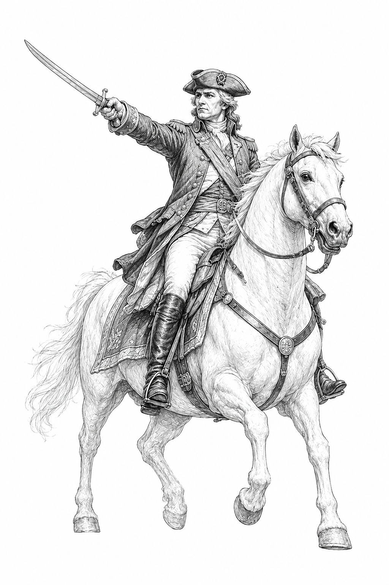
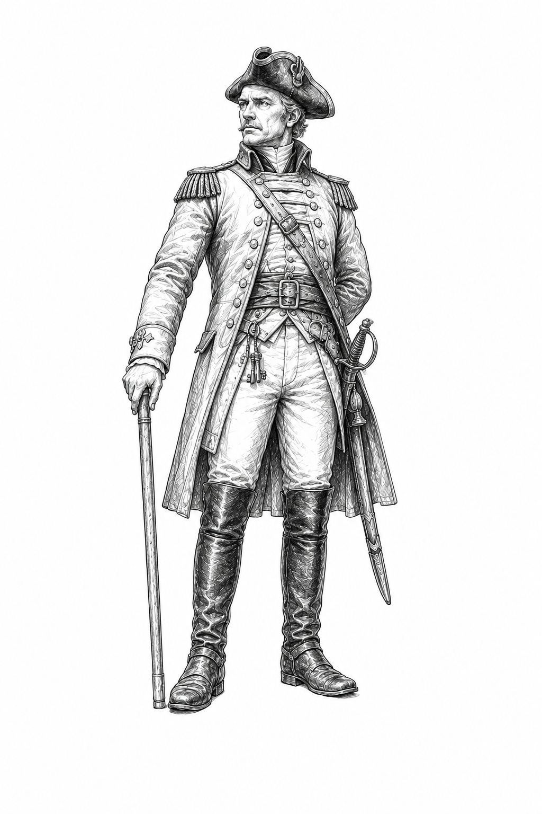

# Gauntlet v0.6 Military Faction Guide

**Status:** Canonical player-facing faction-guide source for v0.6 release assembly.  
**Purpose:** Provide the complete Military-specific rules, leaders, Orders, components, strategy, terminology, and twelve-card pool without reproducing the full core rulebook.

Use this guide with the Gauntlet v0.6 core rules. General movement, battle, retreat, occupation, capture, deck construction, Assets, Overlays, and victory procedures remain in the core rulebook.

Leader illustrations for release layout use:

- `../images/sketches/general.png`
- `../images/sketches/commandant.png`

The printable Leader Cards use the corresponding portraits under `../images/`.

---

## 1. Military overview

The Military wins Gauntlet by taking the field, forcing decisive battles, occupying enemy ground, surviving counterattacks, and converting victory into further pressure or durable control.

> **Faction identity:** Turn battlefield success into strategic advantage while deciding how far to press before success becomes overextension.

- **Victory:** normal breakthrough victory.
- **Resource:** Command, maximum 2.
- **Resource gain:** the first time each turn you win a battle, gain 1 Command, up to the maximum.
- **Leaders:** General or Commandant.
- **Faction pool:** 12 unique cards; curve 1 / 4 / 3 / 3 / 1 at costs 1-5.
- **Statement card:** Shock and Awe, cost 5, Unique.

### Components and setup

A Military deck uses:

1. one selected Leader Card: **General** or **Commandant**;
2. one shared **Military Command Tracker** placed beneath that Leader Card;
3. any Military playable cards included through normal deck construction.

At 0 Command, the Leader Card fully covers the tracker. Slide the Leader upward until its bottom edge reaches the 1 or 2 registration line as Command changes. No separate Command token or first-victory marker is used.

---

## 2. Command and Orders

> **Command:** Maximum 2. The first time each turn you win a battle, gain 1. Spend Command to use Orders.

The trigger is not limited to your own turn. A defensive victory during the opponent's turn can generate Command, and only the first Military victory during that turn generates it.

Use an Order only at its printed timing. Spend the listed Command when the Order is used unless a card reduces or replaces the cost. Command above the maximum is lost. A victory while already at 2 Command still counts as the first Military victory of that turn.

The cap of 2 preserves the choice between using the two 1-Command Orders and saving for the leader's 2-Command signature Order. It also keeps full three-Order sequences exceptional rather than routine.

---

## 3. Military leaders

## General

**Forward. Again.**  
**Style:** attack, forward pressure, tempo.

The General rides where the line is breaking and turns hesitation into motion. Choose the General when you want to initiate engagements, threaten repeated movement, and convert one successful attack into a larger operation.

### General Orders

- **Onward - 1 Command:** Move one additional space this turn. This movement may initiate a battle.
- **Rally - 1 Command:** Before dice are rolled in a battle you initiated, add +1 to your battle total.
- **Rout - 2 Command:** After you win a battle you initiated, move one space toward the opponent's Heartland. This movement may initiate another battle.

General priorities:

- use Onward to create the engagement you want;
- choose between Rally's current-battle certainty and saving 2 Command for Rout;
- remember that a follow-up battle is a new battle with new commitments and destinations;
- know when to stop before momentum becomes overextension.

## Commandant

**We hold. They break.**  
**Style:** defense, counterattack, control.

The Commandant is the iron center of the line. Choose the Commandant when you want to defend controlled ground, survive the opponent's counterattack, and make occupation become lasting control.

### Commandant Orders

- **Entrench - 1 Command:** Before dice are rolled in a battle you did not initiate, add +1 to your battle total.
- **Repel - 1 Command:** After you win a battle you did not initiate, the defeated opponent retreats one additional space, if able.
- **Fortify - 2 Command:** After you win a battle while occupying an enemy Territory, capture that Territory immediately.

Commandant priorities:

- use Entrench and Repel to make attacks and counterattacks costly;
- use Fortify to convert a difficult victory on occupied enemy ground into immediate control;
- turn defensive victories into initiative through Countercharge and related effects;
- hold ground in order to create progress rather than becoming passive.

---

## 4. Playing Military

The central Military decision is **momentum versus consolidation**.

After a victory, decide whether the most valuable outcome is another movement, another battle, immediate capture, Command readiness, retreat pressure, card preservation, or simply stopping before becoming overextended.

### Strengths

- converts victories into movement, retreat pressure, capture, Command, preserved cards, and prepared operations;
- coordinates hand commitments and battle draw;
- changes initiative through pursuit and countercharge;
- prepares visible operations through Assets and Encampment;
- uses one shared card pool differently under its two leaders.

### Limits

Military has:

- no alternate victory condition;
- no broad hand surveillance, generic cancellation, negotiation, economic denial, or unconditional draw engine;
- no automatic superiority in battle math;
- only narrow and expensive capture shortcuts;
- real overextension risk after follow-up movement and battles.

### Strategic threads

| Thread | Cards |
|---|---|
| Command discipline | Unbroken Ranks; Encampment; Field Command |
| Combined commitment | Brothers in Arms; Reserve Force; Hold the Line; Shock and Awe |
| Pursuit and initiative | Give Chase; Countercharge |
| Force preservation | Battlefield Promotion; Rearguard |
| Victory conversion | War Crimes; Shock and Awe |

The pool is a strategic vocabulary, not a set of required packages. Combine Military and Neutral cards around the decisions you want to make without erasing Military's weaknesses.

---

## 5. Military-specific rules reference

### Battle-drawn card

A **battle-drawn card** is a card played from battle draw. It normally goes to discard after the battle unless an effect changes its destination.

### Committed from hand

A Battle card deliberately committed from hand normally goes to the Graveyard after the battle.

### Initiated a battle

Your movement or effect began that battle. The initiating player is the attacker.

### Did not initiate

You are fighting a battle begun by the opponent, including defense against an attack or an occupation counterattack.

### Occupying enemy Territory

Your token is on an opponent-controlled Territory after winning there but before capture.

### Defending a Territory you control

Your token was already on a Territory you control when the battle began.

### Assets

Many Military Action effects bank the card as an Asset. It remains visible and uses Asset-bank capacity. Occupied enemy Territories do not increase that capacity until captured.

### Encampment

Encampment is an Overlay, not an Asset. While it is the top exposed Overlay, it supersedes the printed effect immediately beneath it. Leaving the Territory or temporary enemy occupation does not remove it. It goes to its owner's Graveyard when an opponent gains control of the Territory. Heartlands are not Territories and cannot receive Encampment.

### Additional Battle cards after reveal

When a Military effect lets you play a Battle card after all Battle cards are revealed, play it face up. You may play it only if its Battle effect can still resolve at that timing. It retains its source and follows the destination specified by the effect or the normal destination for that source.

### Victory-result limits

War Crimes and Shock and Awe explicitly prohibit additional movement, capture, or Orders from the same victory after their special outcome is chosen. Follow the specific card text and the core replacement-effect procedure when several effects modify the same movement, retreat, capture, or destination.

---

## 6. Canonical Military card pool

In this section, a **battle-drawn card** is a card played from battle draw.

### Unbroken Ranks

**Cost:** 1  
**Complexity:** Basic

> **Action:** Bank this as an Asset. After you win a battle in which you used no Orders, you may discard it to gain 1 Command.
>
> **Battle:** When you win this battle, if you used no Orders in it, gain 1 Command.

### Battlefield Promotion

**Cost:** 2  
**Complexity:** Basic

> **Action:** Play after you win a battle. Return one battle-drawn card you played in that battle from your discard pile to your hand.
>
> **Battle:** If you win, return one other battle-drawn card you played to your hand instead of discarding it during cleanup.

### Encampment

**Cost:** 2  
**Complexity:** Advanced  
**Card form:** Territory Overlay

> **Action:** Place this as an Overlay on a revealed Territory you occupy and control.
>
> **Overlay:** At the end of your turn, if you occupy and control this Territory, gain 1 Command. When an opponent gains control of it, put this in its owner's Graveyard.
>
> **Battle:** If you win while defending a revealed Territory you control, place this on it as an Overlay during cleanup.

### Rearguard

**Cost:** 2  
**Complexity:** Advanced

> **Action:** Bank this as an Asset. After you lose a battle and retreat, when your opponent would enter your space that turn using an Order or card effect, you may discard this to prevent that movement. No Command is spent; any card used returns to its owner's hand.
>
> **Battle:** If you lose and retreat, bank this during cleanup.

### Brothers in Arms

**Cost:** 2  
**Complexity:** Advanced

> **Action:** Bank this as an Asset. Before committing a Battle card from hand, you may discard this to delay that commitment until after your initial battle draw. Then play one Battle card from hand and one from that draw face up together, or play neither. Both Battle effects must still be able to resolve.
>
> **Battle:** If this is in your initial battle draw and you committed no card from hand, you may choose it as your battle-drawn play and play one Battle card from hand face up with it.

Brothers in Arms pairs exactly one hand commitment with one battle-drawn play. It does not create a third Battle-card play.

### Field Command

**Cost:** 3  
**Complexity:** Advanced

> **Action:** Bank this as an Asset. After using a 1-Command Order, you may discard this to use your leader's other 1-Command Order once this turn, at its next legal timing, for 0 Command.
>
> **Battle:** After using a 1-Command Order during this battle, you may use your leader's other 1-Command Order once this turn, at its next legal timing, for 0 Command. If you do, put this in your Graveyard after that Order resolves.

### Reserve Force

**Cost:** 3  
**Complexity:** Advanced

> **Action:** Bank this as an Asset with another Battle card from your hand face down beneath it. After all Battle cards are revealed in a battle involving you, you may discard this to play the stored card face up as an additional Battle card, if its Battle effect can still resolve. Put the stored card in your Graveyard during cleanup, or immediately if this leaves play before deployment.
>
> **Battle:** After all Battle cards are revealed, you may replace this with a Battle card from your hand whose Battle effect can still resolve. If you do, put this in your Graveyard and play that card face up. Otherwise, discard this during cleanup.

### Give Chase

**Cost:** 3  
**Complexity:** Advanced

> **Action:** Play after you win a battle you initiated. Move one space toward the opponent's Heartland. This may initiate a battle.
>
> **Battle:** If you win and initiated this battle, after the opponent retreats, move one space toward their Heartland. This may initiate a battle.
>
> **Pursuit:** In a battle initiated this way, you cannot commit from hand or use Orders. Draw one fewer card in its initial battle draw for each prior battle this turn after the first, to a minimum of zero. After the movement, put this in your Graveyard.

### Hold the Line

**Cost:** 4  
**Complexity:** Advanced

> **Action:** Bank this as an Asset. When a battle begins in which you defend a Territory you control, before Battle cards are committed, you may put this in your Graveyard to use the effect below.
>
> **Battle:** If you are defending a Territory you control, use the effect below, then put this in your Graveyard during cleanup.
>
> **Effect:** After all Battle cards are revealed, draw two additional battle cards and immediately play up to one face up as an additional Battle card, if its Battle effect can still resolve. If you lose, after you retreat, the opponent captures that Territory immediately.

### Countercharge

**Cost:** 4  
**Complexity:** Advanced

> **Action:** Bank this as an Asset. After you win a battle you did not initiate, you may put this in your Graveyard to use the effect below.
>
> **Battle:** If you win this battle and did not initiate it, use the effect below, then put this in your Graveyard.
>
> **Effect:** After the opponent retreats, move one space toward their Heartland. This may initiate a battle.

### War Crimes

**Cost:** 4  
**Complexity:** Advanced

> **Action:** Bank this as an Asset. After you win a battle, you may put this in your Graveyard to use the effect below.
>
> **Battle:** If you win, you may use the effect below. If you do, put this in your Graveyard during cleanup.
>
> **Effect:** Put every battle-drawn card your opponent played in that battle in their Graveyard instead of their discard pile, and make them retreat one additional space. You cannot move, capture a Territory, or use an Order as a result of that victory.

### Shock and Awe

**Cost:** 5  
**Complexity:** Advanced  
**Unique:** Maximum one copy per deck

> **Action:** Bank this as an Asset. When you initiate a battle on an enemy-controlled Territory, before Battle-card commitments, you may put this in your Graveyard to use the effect below.
>
> **Battle:** If attacking on an enemy-controlled Territory, use the effect below, then put this in your Graveyard during cleanup.
>
> **Effect:** After all Battle cards are revealed, you may play one Battle card from hand face up as an additional Battle card if its Battle effect can still resolve. During cleanup, if you lose, retreat one additional space after your normal retreat. If you win, choose **Breakthrough** or **Consolidate**.
>
> **Breakthrough:** Choose only if the opponent can retreat one additional space. They do so after their normal retreat; then move one space toward their Heartland. This cannot initiate a battle.
>
> **Consolidate:** Capture the contested Territory immediately, then set your Command to 2.
>
> **Limit:** After either option, you cannot move again, capture another Territory, or use an Order from that victory.

---

## Appendix A. Quick reference

### Command

Maximum 2. The first time each turn you win a battle, gain 1 Command. Spend Command to use Orders.

### General

| Order | Cost | Effect |
|---|---:|---|
| Onward | 1 | Move one additional space this turn; may initiate a battle. |
| Rally | 1 | Before dice in a battle you initiated, +1 to your battle total. |
| Rout | 2 | After winning a battle you initiated, move one space toward the enemy Heartland; may initiate another battle. |

### Commandant

| Order | Cost | Effect |
|---|---:|---|
| Entrench | 1 | Before dice in a battle you did not initiate, +1 to your battle total. |
| Repel | 1 | After winning a battle you did not initiate, the defeated opponent retreats one additional space, if able. |
| Fortify | 2 | After winning while occupying enemy Territory, capture it immediately. |

### Card list by cost

| Cost | Cards |
|---:|---|
| 1 | Unbroken Ranks |
| 2 | Battlefield Promotion; Encampment; Rearguard; Brothers in Arms |
| 3 | Field Command; Reserve Force; Give Chase |
| 4 | Hold the Line; Countercharge; War Crimes |
| 5 | Shock and Awe - Unique |

---

Copyright (c) 2026 Tymon Scott. All rights reserved.
