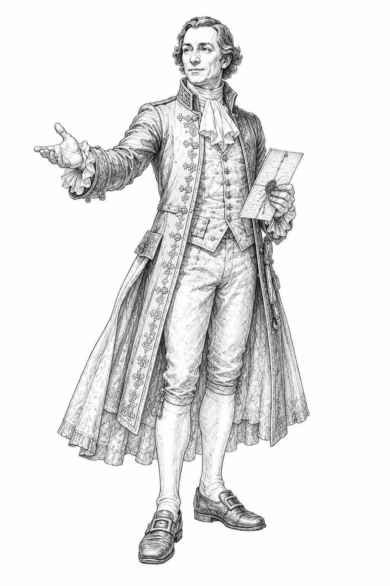
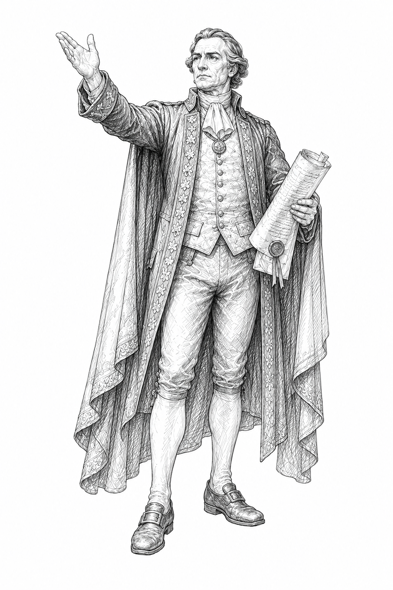
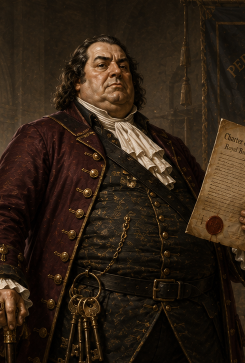
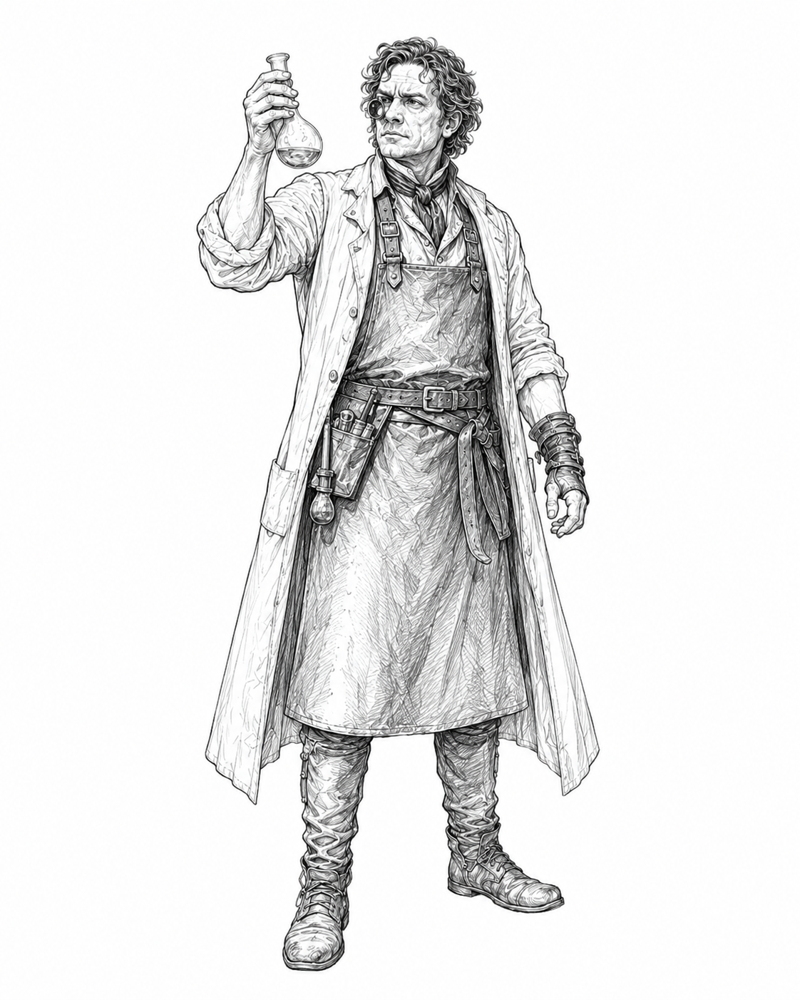

# GAUNTLET

## Official Rulebook

**Version 0.6.0**

---

# Welcome to Gauntlet

Gauntlet is a two-player tactical card game of deck construction, strategy, timing, and territorial control. Before the game begins, each player builds a Deck, chooses one of six factions and one of that faction's Leaders, and selects three Territories to form their side of the battlefield. Both players may choose the same faction or Leader.

Victory belongs to the player who successfully runs the Gauntlet. To do so, advance through a contested line of Territories, overcome the opponent's defenses, and defeat them in a final Last Stand beyond the end of the Gauntlet. Along the way, capture Territories, develop Assets, employ faction mechanics, and decide when valuable cards are worth committing permanently to battle.

The strength and composition of a Deck shape every decision that follows. Careful construction provides the tools to pursue a coherent plan, but victory also requires adapting that plan to the Territories, cards, and opportunities that emerge during play.

---

# Rules Conventions

- When a specific card, Leader, faction, Territory, or supplemental-component rule conflicts with a general rule, follow the specific rule.
- **May** indicates an optional effect. **Must** indicates a required effect.
- Resolve instructions in the order written unless another rule specifies otherwise.
- Within the same timing window, resolve the attacking player's effects before the defending player's effects unless a rule establishes another order.
- Card text overrides a card's normal destination only to the extent stated.
- If an instruction cannot be completed in full, complete as much of it as possible unless the uncompleted instruction is a required cost or target.

## Playing Cards

A card may contain more than one printed effect. The effect that resolves depends on how the card is used.

- When a card is played during an **Action Opportunity**, resolve its **Action effect**.
- When a card is committed from hand or chosen from a Battle Hand, resolve its **Battle effect**.
- If another rule instructs a player to use a card in another way, resolve the effect associated with that method.

Resolving one printed effect does not resolve any other printed effect on the same card unless a rule specifically states otherwise.

---

# 1. Components

Each player needs:

- one **Deck**;
- one **Player Token**; and
- one six-sided die.

The players may share a die if needed.

A **Deck** consists of:

- one **Faction**;
- one **Leader Card**;
- one **Playable Deck**;
- three different **Territory Cards**; and
- any required faction- or Leader-specific supplemental cards or components.

Supplemental cards, reference cards, trackers, and similar components are part of the Deck but are not part of the Playable Deck unless a rule explicitly states otherwise.

## The Gauntlet

Together, both players' Territory Cards form the **Gauntlet**, the six-Territory battlefield on which the game is played.

---

# 2. Building a Deck

## Choose a Faction

Choose one faction. The faction determines:

- the Leaders available to the Deck;
- the faction cards permitted in the Playable Deck; and
- any faction-specific rules or supplemental components used during the game.

## Choose a Leader

Choose one Leader from the selected faction.

The Leader Card begins the game face up and remains available throughout the game. Some Leaders include supplemental cards or other components required by their abilities. These components are part of that Leader's package but are not part of the Playable Deck.

## Build the Playable Deck

The **Playable Deck** is the constructed collection of cards that becomes the Draw Pile during setup.

A Playable Deck must contain:

- at least **30 cards**;
- no more than **60 total deckbuilding value**; and
- only Neutral cards and cards belonging to the selected faction.

Unless marked **Unique**, a card may appear in any quantity permitted by the available card pool. A Unique card is limited to one copy in the Playable Deck.

## Choose Territory Cards

Choose exactly three different Territory Cards.

- No more than one may be an **Arena**.
- Territory Cards are not part of the Playable Deck.
- Territory Cards do not count toward the 30-card minimum or 60-value maximum.
- Both players may choose the same Territory titles.

## Prepare Supplemental Components

Prepare any cards, trackers, references, or other components required by the selected faction or Leader.

Unless a rule explicitly states otherwise, supplemental components:

- are not part of the Playable Deck;
- are not shuffled into the Draw Pile;
- cannot be drawn, played, discarded, banked, or placed in the Graveyard; and
- do not count toward deck size or deckbuilding value.

---

# 3. Setup

Prepare the game in the following order.

1. **Prepare the Draw Pile.** Shuffle the Playable Deck and place it face down to form the **Draw Pile**. Leave space beside it for the **Discard Pile** and **Graveyard**.
2. **Arrange Territories.** Secretly arrange the three Territory Cards in a single line facing their owner.
3. **Form the Gauntlet.** Join both players' Territory lines to create one six-Territory column.
4. **Reveal the Territories.** Once both players have finished arranging them, reveal all six Territory Cards simultaneously. Territories remain face up for the rest of the game unless an effect states otherwise.
5. **Prepare Leaders and supplemental components.** Place the Leader Card face up and prepare any required faction- or Leader-specific components according to their rules.
6. **Place Player Tokens.** Place each Player Token immediately before the Territory at that player's end of the Gauntlet.
7. **Draw opening hands.** Each player draws three cards from their Draw Pile.
8. **Determine the first player.** Both players roll one die. The player with the higher result takes the first turn. Reroll ties.

---

# 4. Turn Structure

Players alternate taking turns until one player wins the game.

Complete each turn in the following order:

1. **Capture**
2. **Draw**
3. **Action Opportunity before movement**
4. **Movement**
5. **Action Opportunity after movement**
6. **Cleanup**

## 1. Capture

At the start of the turn, if the active player occupies a Territory they do not control, they capture it by rotating the Territory Card to face them.

Resolve effects and victory checks that occur after the Capture step before proceeding to the Draw step.

## 2. Draw

Draw one card from the Draw Pile.

If the Draw Pile cannot complete the draw, shuffle the Discard Pile to form a new Draw Pile and continue drawing. If the Draw Pile and Discard Pile cannot provide the full number of cards, draw as many as possible.

Cards already drawn during the current draw are not shuffled back into the Draw Pile.

## 3. Action Opportunity Before Movement

The active player may use their normal Action Opportunity before moving.

## 4. Movement

Advance, hold, or withdraw. Resolve any battle caused by movement immediately.

## 5. Action Opportunity After Movement

If the active player did not use their normal Action Opportunity before movement, they may use it now.

A player may normally play only one card for its Action effect during their turn, using either Action Opportunity. Whenever a player could play a card for its Action effect, they may instead perform a rule or faction action that explicitly uses an Action Opportunity.

An effect that grants an additional Action Opportunity permits one additional qualifying action at the stated timing. It does not grant movement unless it explicitly says so.

## 6. Cleanup

Resolve end-of-turn effects. If the active player has more than three cards in hand, they discard until they have three. The turn then ends.

---

# 5. Movement

Movement changes the position of a Player Token. During the Movement step, choose one:

- **Advance:** Move one position toward the opponent's end of the Gauntlet.
- **Hold:** Remain in the current position.
- **Withdraw:** Move one position toward the player's own end of the Gauntlet.

A player cannot voluntarily withdraw beyond their end of the Gauntlet. Player Tokens cannot move through or past one another.

A **position** is any location a Player Token may occupy: each Territory, the position immediately before either end of the Gauntlet, or the position immediately beyond either end of the Gauntlet.

If an effect grants additional movement, resolve that movement one position at a time unless the effect states otherwise. Entering an occupied position begins a battle and normally pauses the current movement sequence until the battle is resolved.

## Entering an Occupied Territory

When a player advances into a Territory occupied by the opponent, move the attacking Player Token into that Territory before resolving the battle.

Although both Player Tokens are physically in the Territory, the defending player continues to occupy it until the battle is resolved. If the attacking player wins, the defending player retreats and the attacking player then occupies the Territory.

## Withdrawal

Withdrawal is voluntary movement away from the opponent.

- An attacking player who withdraws from a battle returns to the position they entered from, if able.
- A defending player who withdraws moves one position toward their own end of the Gauntlet, if able. The attacking player remains in or occupies the contested position.
- If both players withdraw, move the attacking player first, then the defending player.

Withdrawal is not retreat unless a rule specifically says otherwise.

## Retreat

Retreat is forced displacement after losing a battle. It does **not** count as movement.

Unless an effect states otherwise, the losing player retreats one position away from the winning player and toward their own end of the Gauntlet.

---

# 6. Battles

A battle begins when a player enters a position occupied by the opponent or when a rule explicitly begins one.

The player whose movement or effect began the battle is the **attacking player**. The other player is the **defending player**.

## Resolving a Battle

Resolve each battle in the following order.

### 1. Resolve Begin-Battle Effects

Resolve effects that occur when the battle begins or before cards are committed from hand. A faction mechanic such as Terms may prevent the battle before commitments occur.

### 2. Commit Cards from Hand

In order:

1. the attacking player commits up to one eligible card from hand face down or declines; then
2. the defending player commits up to one eligible card from hand face down or declines.

A hand commitment is optional.

### 3. Form Battle Hands and Choose Cards

In order:

1. the attacking player draws three cards to form their **Battle Hand**, then chooses up to one eligible card from it face down or declines; then
2. the defending player draws three cards to form their Battle Hand, then chooses up to one eligible card from it face down or declines.

Effects may modify the number of cards drawn or chosen. Keep all unchosen Battle Hand cards separate until battle cleanup.

### 4. Reveal Cards

Resolve effects that occur before the normal reveal. Then reveal all committed and chosen cards.

### 5. Resolve Battle Effects

Resolve applicable Battle effects according to their timing. Negation, cancellation, replacement, and source-changing effects resolve before effects that depend on the affected card where necessary.

### 6. Roll Battle Dice

Each player normally rolls one six-sided die.

#### Advantage and Disadvantage

Combine all instances of advantage and disadvantage before rolling. They cancel one-for-one.

- For each net advantage, roll one additional die and use the highest result.
- For each net disadvantage, roll one additional die and use the lowest result.

After selecting the die result, resolve rerolls and die-result changes in their specified order, then apply numerical modifiers to determine the battle total.

### 7. Determine the Winner

The player with the higher battle total wins.

**Defender's Advantage:** If the battle totals are tied and the defending player controls the contested Territory, the defending player wins. The defending player also has Defender's Advantage during their Last Stand.

If a tie is not resolved by Defender's Advantage or another effect, both players reroll. Cards already used remain in effect.

### 8. Resolve the Result

Resolve effects triggered by winning, losing, retreat, occupation, or the end of the battle.

Unless an effect states otherwise:

- the losing player retreats one position;
- a winning attacking player occupies the contested Territory after the defender retreats; and
- a winning defending player remains in the contested position.

### 9. Battle Cleanup

Move cards to their normal destinations:

- each card committed from hand goes to its owner's Graveyard;
- each card chosen from a Battle Hand goes to its owner's Discard Pile; and
- each unchosen card in a Battle Hand goes to its owner's Discard Pile.

Resolve any effects that occur during or after battle cleanup.

## Negated and Canceled Cards

A **negated** card has no effect but remains used and follows its normal destination unless the negating effect states otherwise.

When a used card is **canceled** and the canceling effect gives no destination:

- a canceled hand commitment returns to its owner's hand; and
- a canceled card chosen from a Battle Hand goes to its owner's Discard Pile.

## Resolving or Repeating Other Battle Effects

An effect that resolves or repeats another Battle effect cannot choose an effect that would use another card or resolve or repeat another Battle effect unless it explicitly permits one additional layer. An additional layer cannot create another layer.

When a Battle effect resolves an additional time:

- make all choices again;
- pay all costs again;
- apply source-dependent instructions only when they can legally function; and
- apply instructions that change the source card's destination or status only once.

---

# 7. Territory Control

Winning a battle allows a player to occupy a Territory. Occupation and control are separate states.

## Control

The player a Territory Card faces controls that Territory. Control does not require the controlling player's token to remain there.

Each player begins the game controlling the three Territories on their side of the Gauntlet. Control changes only through capture or a rule that explicitly changes it.

## Occupation

A player normally occupies the position containing their Player Token. During an unresolved attack on an occupied Territory, the defending player continues to occupy it.

A player may occupy a Territory controlled by the opponent.

## Capture

At the start of a player's turn, if they occupy a Territory they do not control, they capture it by rotating the Territory Card to face them.

A captured Territory remains under that player's control until the opponent captures it or an effect changes control.

## Counterattacks

Because a Territory is not captured immediately after a battle, its controller has an opportunity to drive the occupying opponent away before the start of that opponent's next turn.

---

# 8. Running the Gauntlet

To run the Gauntlet, advance through the full Territory column, force the opponent beyond their end of the Gauntlet, capture the final Territory, and win the opponent's Last Stand.

## Forcing the Opponent Beyond the Gauntlet

When a player loses a battle while occupying the final Territory at their end of the Gauntlet, they retreat beyond the Territory column.

The winning player occupies the final Territory. The battle ends normally; the winning player does not immediately advance beyond the Gauntlet.

If the winning player still occupies the final Territory at the start of their next turn, they capture it during the Capture step. During that turn's Movement step, they may advance beyond the final Territory to initiate the opponent's Last Stand.

## Last Stand

When a player advances beyond the final Territory to battle an opponent who has been forced beyond their end of the Gauntlet, that battle is the defending player's **Last Stand**.

During a Last Stand:

- the defending player has **Defender's Advantage**; and
- the defending player adds **+1** to their battle total.

If the attacking player wins the Last Stand, they have run the Gauntlet and immediately win the game.

If the defending player wins, the attacking player retreats to the final Territory. Play continues normally.

Some factions provide an additional victory condition. Those conditions appear in their faction sections.

---

# 9. Game Zones

## Draw Pile

The face-down pile formed by shuffling the Playable Deck during setup.

## Hand

The private cards currently held by a player. Cards in hand may be played for Action effects, committed for Battle effects, or used as directed by another effect. The normal hand limit is three.

## Battle Hand

A temporary hand formed during a battle. A Battle Hand exists only for that battle and is separate from the player's normal hand.

## Discard Pile

A face-up pile of recyclable cards. When a Draw Pile cannot complete a draw, shuffle the Discard Pile to form a new Draw Pile.

## Graveyard

A face-up pile of cards removed from normal circulation. Cards in the Graveyard are not reshuffled unless an effect explicitly moves them.

## Asset Bank

The public area containing a player's banked Assets.

Faction rules may create additional named areas. Those areas follow the rules that create them.

---

# 10. Actions, Assets, and Overlays

## Action Effects

To play a card for its Action effect:

1. play it from hand during an Action Opportunity;
2. satisfy any stated cost or requirement;
3. resolve its Action effect; and
4. put it in the Discard Pile unless it becomes an Asset or Overlay or specifies another destination.

## Assets

A card is an Asset only when an effect banks it in the Asset Bank.

A player's **Asset limit** equals the number of Territories they control.

- A Territory occupied but not controlled does not increase the Asset limit.
- If the Asset limit falls below the number of Assets in the Asset Bank, immediately choose and discard Assets until within the limit.
- An inactive Asset still counts toward the Asset limit unless a rule says otherwise.

Whenever a player could play a card for its Action effect, they may instead discard one Asset they control unless an effect prohibits it. This uses that Action Opportunity.

## Overlays

An Overlay is a persistent card attached to a Territory. It supersedes the printed effect of the card immediately beneath it while exposed.

Unless an effect states otherwise:

- the top exposed Overlay is active;
- any lower Overlays remain attached but are dormant;
- a dormant Overlay's effect and expiration timer pause, but a printed condition that removes it remains active;
- when the top Overlay leaves, the next exposed Overlay becomes active, or the Territory's printed effect becomes active if none remains;
- the Overlay's owner makes all choices for its effect;
- changing control of the Territory does not change ownership, remove, or reorder its Overlays;
- each Overlay faces the same direction as the Territory beneath it and rotates with that Territory when control changes;
- an Overlay is not an Asset and does not count toward the Asset limit; and
- when removed, an Overlay follows the destination stated by its effect or its normal card destination if none is stated.

---

# 11. Military

The Military converts battle victories into Command, movement, retreat pressure, and immediate capture. It has no additional victory condition and wins by running the Gauntlet.

## Components and Setup

A Military Deck includes a Military Leader Card and a Command Tracker. Begin with 0 Command by fully covering the tracker with the Leader Card.

## Command

Military may have up to 2 Command. The first time each turn the Military player wins a battle, gain 1 Command, up to the maximum. This may occur during either player's turn.

Spend Command to use Orders printed on the chosen Leader Card.

## General

**Archetype:** Attack, forward pressure, and tempo  
**Motto:** *Forward. Again.*

The General leads from the decisive point, using Command to advance, reinforce an attack, and pursue a defeated opponent.

### Orders

- **Onward — 1 Command:** Move one additional position this turn. Resolve the movement one position at a time. It may initiate a battle.
- **Rally — 1 Command:** Before dice are rolled in a battle initiated by the General, add +1 to the Military player's battle total.
- **Rout — 2 Command:** After winning a battle initiated by the General, move one position toward the opponent's end of the Gauntlet. This movement may initiate another battle.

## Commandant

**Archetype:** Defense, counterattack, and control  
**Motto:** *We hold. They break.*

The Commandant turns a defended position into lasting control through prepared defenses, forced retreats, and immediate capture.

### Orders

- **Entrench — 1 Command:** Before dice are rolled in a battle the Commandant did not initiate, add +1 to the Military player's battle total.
- **Repel — 1 Command:** After winning a battle the Commandant did not initiate, the defeated opponent retreats one additional position, if able.
- **Fortify — 2 Command:** After winning while occupying an enemy-controlled Territory, capture that Territory immediately.

---

# 12. Diplomats

The Diplomats use Influence and Terms to prevent battles, impose settlements, and ratify Treaty Articles. They may win by running the Gauntlet or through the Peace Treaty.

## Components and Setup

A Diplomat Deck includes a Diplomat Leader Card, Influence Tracker, Diplomat Reference Card, and nine double-sided Proposal / Treaty Article cards.

Begin with 1 Influence. Place all nine Proposals Proposal side up.

## Influence

Influence has a minimum of 0 and maximum of 10. Influence staked on Terms is unavailable until those Terms resolve.

## Offering Terms

Before a battle involving the Diplomat, before either player commits a card from hand, the Diplomat may choose one eligible Proposal and stake its listed Influence. The opponent accepts or refuses.

### Accepted Terms

When Terms are accepted:

1. no battle occurs;
2. resolve the Proposal's Accepted effect;
3. return the Stake;
4. if the Proposal is not already ratified, flip it to its Treaty Article side; and
5. if newly ratified, gain Influence equal to its Stake.

### Refused Terms

When Terms are refused:

1. resolve the Proposal's Refused effect;
2. continue into the battle;
3. before dice, the Diplomat may use Leverage; and
4. resolve the Stake and ratification according to the result.

| Result | Stake | Ratification | Normal reward |
|---|---|---|---|
| Diplomat wins | Return | If new, impose and ratify | Gain 1 Influence unless stated otherwise |
| Diplomat loses | Lose | None | None |
| No winner | Return | None | None |

### Leverage

Before dice are rolled following refused Terms, spend any amount of available Influence. Add +1 to the Diplomat's battle total for each Influence spent.

## Peace Treaty

After the Capture step at the start of the Diplomat's turn, if five different Proposals are ratified, the Diplomat immediately wins.

## Ambassador

**Archetype:** Agreement, card flow, and settlement  
**Motto:** *Words first. War last.*

The Ambassador sustains continued negotiation by converting accepted Terms into additional cards.

### Cordiality

Once per turn, after the opponent accepts the Ambassador's Terms, draw one card.

## Senator

**Archetype:** Risk management, resilience, and imposition  
**Motto:** *Procedure endures.*

The Senator preserves political capital through sacrifice when refused Terms end in defeat.

### Political Capital

Once per turn, when the Senator would lose staked Influence after losing a battle following refused Terms, they may put up to that many cards from hand in their Graveyard. Recover 1 staked Influence for each card put there; lose the rest.

---

# 13. Financiers

The Financiers convert cards and Territory control into Capital, Capital into Deeds, and Deeds into income or Controlling Interest. They may win by running the Gauntlet or by owning every Deed currently in it.

## Components and Setup

A Financier Deck includes a Financier Leader Card, Financier Reference Card, Capital Tracker, and access to eight shared Deed Cards.

Begin with 0 Capital and an empty Treasury. Place the Deed Cards in a shared unowned supply.

## Capital and Treasury

> **Capital limit = Territories controlled + total deckbuilding value of cards in Treasury**

Capital may temporarily exceed the limit. At the end of every turn, reduce excess Capital to the current limit.

During the Action Opportunity after movement, instead of playing a card for its Action effect, place one card from hand face up in the **Treasury**. Treasury cards are outside normal card zones and do not use Asset capacity.

## Deeds

Each Territory currently in the Gauntlet has one Deed. Deed ownership is independent of Territory control and occupation.

During the Action Opportunity after movement, instead of playing a card for its Action effect, buy or buy out one Deed by paying its cost.

> **Deed cost = min(Deeds owned + 1, 6) + position modifier + buyout premium**

The minimum cost is 1 Capital.

| Territory state from buyer's perspective | Modifier |
|---|---:|
| Buyer controls it | -1 |
| Buyer occupies it but does not control it | 0 |
| Buyer neither controls nor occupies it | +1 |

For a Deed owned by the opposing Financier:

> **Buyout premium = min(Deeds owned by the opposing owner, 6)**

## Income and Controlling Interest

After the Capture step at the start of the Financier's turn, gain 1 Capital for each Deed owned.

When a Financier owns the Deeds to every Territory currently in the Gauntlet, they immediately win by **Controlling Interest**.

## Play the Market

During the Action Opportunity after movement, instead of playing a card for its Action effect, discard one card from hand and roll one die.

| Roll | Result |
|---:|---|
| 1 | Put the card in the Graveyard; gain 0 Capital |
| 2–3 | Gain 1 Capital |
| 4–5 | Gain Capital equal to the card's deckbuilding value |
| 6 | Gain Capital equal to twice the card's deckbuilding value |

## Subsidize

Before dice are rolled in a battle involving the Financier, spend Capital to add to the battle total.

| Bonus | Total cost |
|---:|---:|
| +1 | 1 Capital |
| +2 | 3 Capital |
| +3 | 6 Capital |
| +4 | 10 Capital |

Each additional +1 costs one more Capital than the previous increment.

## Banker

**Archetype:** Collateral, planned purchases, and flexible financing  
**Motto:** *Credit closes the distance.*

The Banker uses a card in hand or Treasury as collateral to complete a Deed purchase with less available Capital.

### Line of Credit

The first time on the Banker's turn that they would buy or buy out a Deed, they may use one card from hand or Treasury as collateral.

- It contributes payment equal to its deckbuilding value.
- It cannot contribute more than half the purchase cost, rounded down.
- Pay the remaining cost with Capital.
- Put the collateral card in the Discard Pile after the purchase.
- Unused collateral value is lost.

## Executive

**Archetype:** Offensive acquisition, occupation, and immediate control  
**Motto:** *Take the ground. Close the deal.*

The Executive may convert an offensive battlefield victory into an immediate Deed purchase and change of control.

### Hostile Takeover

During the Action Opportunity after movement, instead of playing a card for its Action effect, if the Executive won a battle this turn that caused them to occupy an enemy-controlled Territory, they may buy or buy out that Territory's Deed.

Treat the Territory as occupied but not controlled when calculating the cost. If the purchase succeeds, immediately take control of that Territory.

---

# 14. Intelligence

Intelligence uses hidden Missions, Intel, and advance knowledge of opposing battle choices. It may win by running the Gauntlet or by completing a Special Operation.

## Components and Setup

An Intelligence Deck includes an Intelligence Leader Card, Mission Reference Card, Operations Reference Card, Intelligence Resource Tracker, Intel marker, and Operation Progress marker.

Begin with 0 Intel and 0 Operation Progress. Neither has a maximum.

## Missions

Only an Intelligence card with a printed Mission requirement may become an Active Mission or Special Operation.

### Starting a Mission

During the Action Opportunity after movement, instead of playing a card for its Action effect, place one eligible card from hand face down as the **Active Mission**.

- Only one Active Mission may be maintained.
- It cannot complete during the turn it begins.
- Its requirement counts only while it is the Active Mission.

### Completing a Mission

During the Action Opportunity after movement, instead of playing a card for its Action effect, reveal and complete a satisfied Active Mission.

- Gain 1 Operation Progress.
- Gain Intel equal to the Mission card's deckbuilding value.
- Put the Mission in the Discard Pile.

### Aborting and Failing

During the Action Opportunity after movement, spend Intel equal to the Mission's value to abort it and put it in the Discard Pile. A Mission that fails is revealed and placed in the Graveyard.

## Surveillance and Interference

Once per battle, when the opponent commits a face-down card from hand or chooses a face-down card from a Battle Hand, spend 1 Intel to look at it.

Immediately afterward, spend 2 additional Intel to use **Interference** and remove that card from the battle. The opponent may replace it from the same source or decline.

## Special Operation

A Special Operation may begin only when:

- Operation Progress is greater than the number of Territories the opponent controls;
- no Active Mission or Special Operation is present; and
- an eligible Intelligence card is available in hand.

Begin it during the Action Opportunity after movement instead of playing a card for its Action effect. It fails immediately if Operation Progress ceases to exceed the opponent's controlled Territories.

To complete a ready Special Operation, satisfy its Mission requirement and pay Intel equal to:

> **Territories currently in the Gauntlet − Special Operation card's deckbuilding value**

The minimum payment is 1 Intel. Completing the Special Operation immediately wins the game.

## Ranger

**Archetype:** Territory effects, reconnaissance, and field operations  
**Motto:** *Know the land before the battle begins.*

The Ranger spends Intel to prevent a printed Territory effect from affecting an operation.

### Fieldcraft

Once per turn, when a Territory effect would affect the Ranger, their movement, or a battle involving them, spend 1 Intel to ignore that Territory effect until the end of the turn.

Fieldcraft affects only the Territory's printed effect. It does not alter control, occupation, capture, Defender's Advantage, the Last Stand bonus, or limits calculated from Territories.

## Spymaster

**Archetype:** Mission tempo and operational coordination  
**Motto:** *Information never rests. Momentum is the weapon.*

The Spymaster may begin another normal Mission immediately after completing one.

### Mission Control

Once per turn, after completing a normal Mission, immediately start another eligible Mission from hand without using an Action Opportunity. The new Mission cannot complete that turn and cannot be the Special Operation.

---

# 15. Mystics

The Mystics sacrifice, bind, exchange, and recover cards while completing three public Rites. They use no faction resource. They may win by running the Gauntlet or by completing Ritual.

## Components and Setup

A Mystics Deck includes a Mystics Leader Card, Mystics Reference Card, and three double-sided Rite cards: **Rite of Echoes**, **Rite of Blood**, and **Rite of Crossing**.

Place all three Rites incomplete side up.

## Rites and Ritual

During the Action Opportunity after movement, instead of playing a card for its Action effect, begin one incomplete Rite by paying its beginning cost.

- Only one Rite may be begun but incomplete at a time.
- A Rite cannot complete during the turn it begins.
- Only one Rite may be completed per turn.
- If interrupted, the Rite resets and paid costs are not returned unless stated otherwise.

Complete the first Rite to unlock **Invocation**. Complete the second to unlock **Transmutation**. Complete the third to immediately win by **Ritual**.

### Rite of Echoes

Bind one selected Graveyard card face up and one hand card face down whose title matches another card in the Playable Deck. On a later turn, complete the Rite by using another card with the bound hand card's title for its Battle effect. Losing a battle first interrupts the Rite and places both bound cards in the Graveyard.

### Rite of Blood

Put one card from hand in the Graveyard. On a later turn, complete the Rite by winning a battle without committing a card from hand and without using a card from the Battle Hand. Losing a battle first interrupts the Rite.

### Rite of Crossing

Begin only during the Action Opportunity after movement after winning a battle that caused the Mystic to occupy a Territory the opponent controlled immediately before that battle. Put one Arcane card from hand in the Graveyard, or reveal the hand and move one Arcane card from the Discard Pile to the Graveyard if none is in hand. After the next Capture step, complete the Rite if the Mystic still occupies or controls that Territory; otherwise it is interrupted.

## Invocation

Once per turn, when the Mystic uses an Arcane card for its Action effect or Battle effect, move one card from the Graveyard to the Discard Pile.

## Transmutation

Once per turn, before dice are rolled in a battle involving the Mystic, put one card from hand in the Graveyard. Add its deckbuilding value to the Mystic's battle total. This is not a hand commitment and resolves no printed effect on the sacrificed card.

## Bound Cards

A bound card is outside every normal card zone and may move only as instructed by the effect to which it is bound. If that effect ends without assigning a destination, put the bound card in its owner's Graveyard.

## Alchemist

**Archetype:** Sacrifice sequencing and card conversion  
**Motto:** *Nothing is fixed. Everything can be transformed.*

The Alchemist replaces the first card deliberately sacrificed from hand through a Rite, Transmutation, or Arcane card effect during their turn.

### Materia Prima

The first time on the Alchemist's turn that they put a card from hand in the Graveyard as part of a Rite, Transmutation, or an Arcane card effect, draw one card.

If this occurs during a battle, draw after the battle resolves. A normal hand commitment does not trigger Materia Prima merely because it later enters the Graveyard.

## Spirit Walker

**Archetype:** Ritual endurance and protective sacrifice  
**Motto:** *The spirits remember what the living abandon.*

The Spirit Walker may sacrifice an Arcane card to prevent the first battle-loss interruption of a Rite during their turn.

### Guardians of the Circle

The first time on the Spirit Walker's turn that they lose a battle and a begun Rite would be interrupted, they may put one Arcane card from hand in the Graveyard. If they do, that Rite is not interrupted.

This cannot preserve a continuing position requirement. It cannot preserve Rite of Crossing if the Spirit Walker no longer occupies or controls its required Territory.

---

# 16. Inquisition

The Inquisition turns opposing commitments and permanent losses into Conviction, then spends that Conviction to suppress or condemn additional cards. It may win by running the Gauntlet or through Purification.

## Components and Setup

An Inquisition Deck includes an Inquisition Leader Card, Doctrine Reference Card, Purge Reference Card, and Conviction Tracker.

Begin with 0 Conviction. The maximum is 4.

## Conviction

The first time each turn one or more opposing cards enter the Graveyard after a battle involving the Inquisition player, gain 1 Conviction.

This trigger may occur during either player's turn. Several qualifying cards from the same battle still grant only 1 normal Conviction.

## Condemnation

In a battle involving the Inquisition, each opposing card used from a Battle Hand goes to its owner's Graveyard during cleanup instead of the Discard Pile. Opposing cards committed from hand already go to the Graveyard normally. Unchosen Battle Hand cards are discarded normally.

## Blasphemy

Whenever the opponent uses a card with the Arcane trait for its Action effect or Battle effect, gain 1 Conviction. This gain is outside the normal once-per-turn limit but cannot raise Conviction above 4.

## Purge

During an Action Opportunity, instead of playing a card for its Action effect, spend Conviction to use one Purge.

| Cost | Effect |
|---:|---|
| 1 | Put the top card of the opponent's Discard Pile in their Graveyard; or put up to two cards there with combined deckbuilding value 2 or less in their Graveyard. |
| 2 | Put one opposing Asset in its owner's Graveyard. |
| 3 | The opponent chooses one card from hand and puts it in their Graveyard. |
| 4 | Look at the opponent's hand, choose one card, and put it in their Graveyard. |

## Purification

After the opponent's normal Draw step, if they drew no card because both their Draw Pile and Discard Pile were empty, the Inquisition immediately wins by **Purification**.

## Grand Inquisitor

**Archetype:** Judgment, Purge, and permanent removal  
**Motto:** *We judge. We purge.*

The Grand Inquisitor converts a battle victory into an immediate discounted Purge.

### Final Judgment

Once per turn, after the Grand Inquisitor wins a battle, they may immediately Purge without using an Action Opportunity. Reduce that Purge's Conviction cost by 1, to a minimum of 1.

## Witch Hunter

**Archetype:** Defense, retaliation, and pursuit  
**Motto:** *You ran. I followed.*

The Witch Hunter ends an attacking opponent's turn after defeating them, then pursues immediately.

### Relentless Pursuit

Once per turn, after an opponent loses a battle they initiated against the Witch Hunter, spend 2 Conviction to:

1. end the opponent's turn;
2. move one position toward the opponent's end of the Gauntlet; and
3. if that movement initiates a battle, resolve it immediately with the Witch Hunter as the attacking player.

No Action Opportunity occurs between the ended turn and this movement.

---

# 17. Glossary

**Action Opportunity:** A point during a turn when a player may play a card for its Action effect or perform another rule or faction action that explicitly uses the opportunity.

**Advance:** Move one position toward the opponent's end of the Gauntlet.

**Advantage:** Roll one additional battle die for each net advantage and use the highest result.

**Asset:** A card banked in a player's Asset Bank.

**Asset Bank:** The public area containing a player's Assets.

**Battle Hand:** A temporary hand formed during a battle, separate from the player's normal hand.

**Capture:** Gain control of an occupied Territory by rotating it to face the occupying player during the Capture step or as directed by an effect.

**Control:** A player controls a Territory when the Territory Card faces that player.

**Deck:** A player's complete pregame package: faction, Leader, Playable Deck, three Territory Cards, and required supplemental components.

**Defender's Advantage:** The defending player wins a tied battle total when they control the contested Territory or are defending during their Last Stand.

**Disadvantage:** Roll one additional battle die for each net disadvantage and use the lowest result.

**Draw Pile:** The face-down pile formed by shuffling a Playable Deck during setup.

**Graveyard:** A face-up pile of cards removed from normal circulation.

**Hold:** Remain in the current position during movement.

**Last Stand:** The battle fought beyond a player's end of the Gauntlet after that player has been forced beyond the Territory column.

**Mission:** An Intelligence card with a printed Mission requirement while it is used as an Active Mission or Special Operation.

**Occupy:** Hold a position. During an unresolved attack on an occupied Territory, the defending player continues to occupy that Territory.

**Overlay:** A persistent card attached to a Territory. The top exposed Overlay is active; lower Overlays are dormant.

**Playable Deck:** The constructed collection of cards that becomes the Draw Pile during setup.

**Position:** A Territory or the position immediately before or beyond either end of the Gauntlet.

**Retreat:** Forced displacement after losing a battle. Retreat does not count as movement.

**Run the Gauntlet:** Advance through the Territory column, capture the opponent's final Territory, and win the opponent's Last Stand.

**Territory:** One of the six cards forming the Gauntlet.

**Withdraw:** Voluntarily move one position toward the player's own end of the Gauntlet.

---

# Quick Reference

## Setup

1. Shuffle the Playable Deck to form the Draw Pile.
2. Secretly arrange three Territories.
3. Join both Territory lines and reveal all six.
4. Prepare the Leader and supplemental components.
5. Place the Player Token before that player's end of the Gauntlet.
6. Draw three cards.
7. Roll to determine the first player; reroll ties.

## Turn

1. Capture a Territory occupied but not controlled.
2. Draw one card.
3. Use the Action Opportunity before movement, if desired.
4. Advance, hold, or withdraw; resolve any battle.
5. Use the Action Opportunity after movement if the first was unused.
6. Resolve end-of-turn effects and discard down to three cards.

## Battle

1. Resolve begin-battle effects.
2. Attacker commits from hand or declines; defender does the same.
3. Attacker forms a Battle Hand and chooses a card or declines; defender does the same.
4. Resolve special reveal effects, then reveal all used cards.
5. Resolve Battle effects.
6. Roll battle dice; combine advantage and disadvantage, apply rerolls and modifiers.
7. Determine the winner; apply Defender's Advantage where applicable.
8. Resolve victory, loss, retreat, and occupation effects.
9. Put hand commitments in the Graveyard and all Battle Hand cards in the Discard Pile unless an effect states otherwise.

## Running the Gauntlet

1. Win on the opponent's final Territory.
2. The opponent retreats beyond the Gauntlet; occupy the final Territory.
3. Capture it at the start of the next turn if still occupied.
4. Advance beyond it to initiate the opponent's Last Stand.
5. The defender has Defender's Advantage and +1.
6. Win the Last Stand to run the Gauntlet and win the game.
