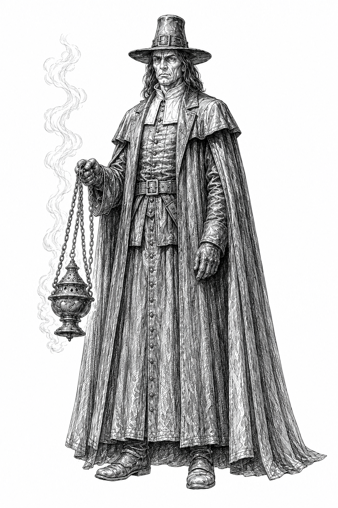
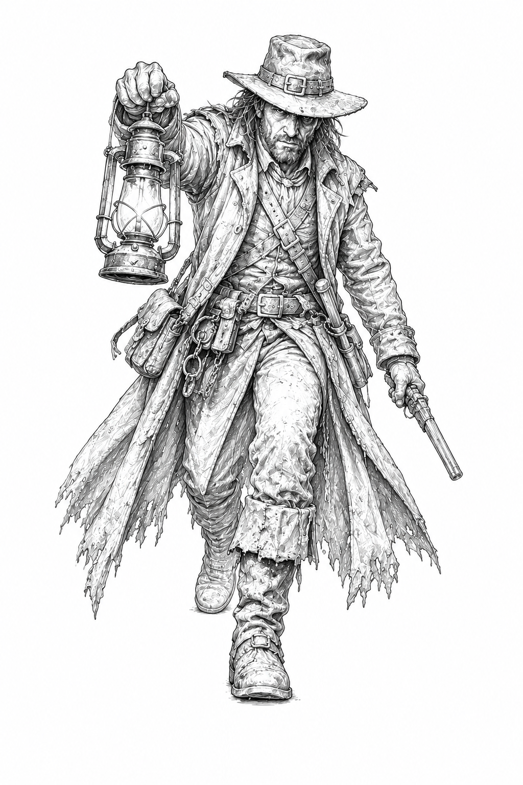

# Gauntlet v0.6 Inquisition Faction Guide

> **Definitive v0.6 Inquisition faction source.** This guide governs all Inquisition-specific rules, Leaders, Conviction, Condemnation, Blasphemy, Purge, Purification, supplemental components, and the canonical twelve-card Inquisition pool. General movement, battle, capture, Asset, and victory rules remain in the core rulebook.

## 1. Inquisition overview

The Inquisition turns opposing card commitments and permanent losses into Conviction, then spends that Conviction to suppress or condemn additional cards. It may win by running the Gauntlet or through Purification.

### At a glance

| **ELEMENT** | **INQUISITION RULE** |
|---|---|
| **Victory** | Run the Gauntlet or achieve Purification. |
| **Resource** | Conviction, maximum 4. |
| **Normal gain** | The first time each turn one or more opposing cards enter the Graveyard after a battle involving you, gain 1 Conviction. |
| **Doctrine** | Condemnation and Blasphemy. |
| **Faction action** | Purge. |
| **Leaders** | Grand Inquisitor and Witch Hunter. |
| **Faction pool** | 12 Inquisition card titles. |
| **Arcane card** | Heresy. |

### Components

An Inquisition Deck includes:

- one Inquisition Leader Card: **Grand Inquisitor** or **Witch Hunter**;
- one **Inquisition Doctrine Reference Card**;
- one **Purge Reference Card**;
- one **Conviction Tracker**; and
- any Inquisition cards included in the Playable Deck.

### Setup

1. Place the chosen Leader Card face up near your play area.
2. Place the Conviction Tracker directly beneath it, fully covered, to show 0 Conviction.
3. Keep both Reference Cards available.

Slide the Leader Card upward to the 1, 2, 3, or 4 registration line as Conviction changes. No separate Conviction token is used.

## 2. Conviction, doctrine, Purge, and Purification

### Conviction

The first time each turn one or more opposing cards enter the Graveyard after a battle involving you, gain 1 Conviction, up to the maximum of 4.

- This trigger may occur during either player's turn.
- Several opposing cards entering the Graveyard from the same battle still grant only 1 normal Conviction.
- Winning the battle is not required.
- Conviction gained above 4 is lost.

### Condemnation

In a battle involving you, each opposing card used from a Battle Hand goes to its owner's Graveyard during cleanup instead of the Discard Pile.

Opposing cards committed from hand already go to the Graveyard normally. Unchosen cards remaining in an opposing Battle Hand are discarded normally.

### Blasphemy

Whenever the opponent uses a card with the **Arcane** trait for its Action effect or Battle effect, gain 1 Conviction.

Blasphemy is outside the normal once-per-turn Conviction limit but cannot raise Conviction above 4. Arcane is a trait, not a faction allegiance.

### Purge

During an Action Opportunity, instead of playing a card for its Action effect, you may spend Conviction to use one Purge:

| **COST** | **PURGE** |
|---:|---|
| **1** | Choose one: put the top card of the opponent's Discard Pile in their Graveyard; or choose up to two cards in their Discard Pile with combined deckbuilding value 2 or less and put them in their Graveyard. |
| **2** | Choose one opposing Asset and put it in its owner's Graveyard. |
| **3** | The opponent chooses one card from hand and puts it in their Graveyard. |
| **4** | Look at the opponent's hand. Choose one card and put it in their Graveyard. |

A Purge uses that Action Opportunity but is not playing a card. Final Judgment may permit a Purge outside an Action Opportunity.

### Purification

After the opponent's normal Draw step at the start of their turn, if they drew no card because both their Draw Pile and Discard Pile were empty, you immediately win by **Purification**.

Purification is checked only after the normal Draw step, not after a Battle Hand draw or another card-effect draw. Cards in hand, the Graveyard, the Asset Bank, or other zones do not prevent Purification unless a rule moves them into the Draw Pile or Discard Pile before the check.

## 3. Inquisition Leaders

### Grand Inquisitor

**Archetype:** Judgment, Purge, and permanent removal  
**Motto:** *We judge. We purge.*

The Grand Inquisitor may convert a battle victory into an immediate discounted Purge.

#### Final Judgment

Once per turn, after you win a battle, you may immediately Purge without using an Action Opportunity. Reduce that Purge's Conviction cost by 1, to a minimum of 1.

### Witch Hunter

**Archetype:** Defense, retaliation, and pursuit  
**Motto:** *You ran. I followed.*

The Witch Hunter may end an attacking opponent's turn after defeating them, then pursue them immediately.

#### Relentless Pursuit

Once per turn, after an opponent loses a battle they initiated against you, you may spend 2 Conviction. If you do:

1. end the opponent's turn;
2. move one position toward the opponent's end of the Gauntlet; and
3. if that movement initiates a battle, resolve it immediately with you as the attacking player.

No Action Opportunity occurs between the ended turn and this movement.

## 4. Inquisition-specific rules

### Conviction after battle

The normal Conviction trigger checks cards entering the opponent's Graveyard during battle cleanup or through an after-battle effect resulting from that battle. One or several qualifying cards from that battle produce only one normal Conviction gain during that turn.

### Discard Pile order

The top card of a Discard Pile is the most recently placed card unless a rule explicitly changes the order. Choosing cards from a Discard Pile does not reorder the cards left there.

### Combined deckbuilding value

When an effect permits several cards with a combined value limit, add their printed deckbuilding values. The total cannot exceed the stated limit.

### Negate

A negated card remains used and follows its normal destination, but its text has no effect unless another rule changes that destination. Negation does not return a card to its source unless stated.

### No Martyrs

No Martyrs prevents the losing opponent from benefiting from effects they control that trigger from that loss or the resulting retreat. It does not prevent the retreat, harmful consequences, or effects controlled by another player.

### Heresy and copied Battle effects

Heresy may resolve an opposing Battle effect that itself resolves one additional Battle effect. That additional effect cannot resolve another.

The chosen Graveyard card remains there. Resolve only effect text that can legally function at the current timing. Apply the shared rules for source-dependent or impossible instructions.

## 6. Canonical Inquisition card pool

### Accusation

**Cost:** 1

> **Action:** Choose one card in the opponent's Discard Pile. They put it on top of their Draw Pile or in their Graveyard.
>
> **Battle:** After the battle, choose one card in the opponent's Discard Pile. They put it on top of their Draw Pile or in their Graveyard.

### Confession

**Cost:** 2

> **Action:** Look at the opponent's hand and choose one card with a Battle effect. Until the end of the turn, if they commit a card from hand in a battle involving you, they must commit the chosen card if able.
>
> **Battle:** After both players complete their hand commitments and Battle Hand choices, before the normal reveal, reveal this and the opponent's hand commitment, if any. You may return your own hand commitment to your hand and replace it with another eligible card from hand, revealed face up.
>
> **Reminder:** This permits one replacement, not an additional commitment.

### Penance

**Cost:** 2

> **Action:** The opponent chooses one: put one card from hand in their Graveyard, or you gain 1 Conviction.
>
> **Battle:** After all cards in the battle are revealed, the opponent chooses one: put one card from hand in their Graveyard, or add +1 to your battle total.

### Divine Mercy

**Cost:** 2

> **Action:** Choose one card in the opponent's Graveyard and move it to their Discard Pile. Then gain 2 Conviction.
>
> **Battle:** Choose one card in the opponent's Graveyard and move it to their Discard Pile. Then add +2 to your battle total.

### No Martyrs

**Cost:** 3  
**Card form:** Asset

> **Action:** Bank this as an Asset. After all cards in a battle involving you are revealed, you may discard this. If you do and the opponent loses, they cannot benefit from effects they control triggered by that loss or retreat, and they retreat one additional position.
>
> **Battle:** If the opponent loses, they cannot benefit from effects they control triggered by that loss or retreat, and they retreat one additional position.

### Excommunication

**Cost:** 3

> **Action:** Choose one or more cards in the opponent's Discard Pile with combined deckbuilding value up to 5. Put them in their Graveyard.
>
> **Battle:** After the battle, choose one or more cards in the opponent's Discard Pile with combined deckbuilding value up to 3. Put them in their Graveyard.

### Guilt by Association

**Cost:** 3

> **Action:** Choose one card in the opponent's Discard Pile. Put every card there with that title in their Graveyard.
>
> **Battle:** After the battle, choose one card the opponent used in that battle. Put every card in their Discard Pile with that title in their Graveyard.

### Act of Faith

**Cost:** 3

> **Action:** Reveal up to three cards from the top of the opponent's Draw Pile. Put one in their Graveyard and the rest in their Discard Pile.
>
> **Battle:** After the battle, reveal up to two cards from the top of the opponent's Draw Pile. Put one in their Graveyard and the rest in their Discard Pile.
>
> **Reminder:** If only one card is revealed, put it in the Graveyard.

### Tyranny

**Cost:** 4  
**Card form:** Asset

> **Action:** Bank this as an Asset. Once per turn, after all cards in a battle involving you are revealed, you may spend 1 Conviction to negate one opposing card used in the battle.
>
> **Battle:** Negate one opposing card used in the battle.

### Burning at the Stake

**Cost:** 4

> **Action:** The opponent reveals their hand. Put the card with the highest deckbuilding value in their Graveyard; choose among ties. If it has the Arcane trait, gain 1 Conviction.
>
> **Battle:** If the opponent loses, they reveal their hand. Put the card with the highest deckbuilding value in their Graveyard; choose among ties. If it has the Arcane trait, gain 1 Conviction.
>
> **Reminder:** If the opponent has no cards in hand, this effect does nothing.

### Heresy

**Cost:** 5  
**Trait:** Arcane

> **Battle:** You may spend 4 Conviction to choose one card in the opponent's Graveyard and resolve its Battle effect as though you had used it. That effect may resolve one additional Battle effect; the additional effect cannot resolve another.
>
> The chosen card remains in the opponent's Graveyard.

### Hellfire

**Cost:** 5

> **Action:** Spend any amount of Conviction. Put that many cards from the top of the opponent's Draw Pile in their Graveyard.
>
> **Battle:** After all cards in the battle are revealed, spend any amount of Conviction. For each Conviction spent, choose one: add +1 to your battle total; or, if you win, after the battle put the top card of the opponent's Draw Pile in their Graveyard. You may choose either option more than once.
>
> **Reminder:** Each Conviction provides only one chosen benefit.

## 7. Card-pool summary

| **COST** | **INQUISITION CARDS** |
|---:|---|
| **1** | Accusation |
| **2** | Confession, Penance, Divine Mercy |
| **3** | No Martyrs, Excommunication, Guilt by Association, Act of Faith |
| **4** | Tyranny, Burning at the Stake |
| **5** | Heresy, Hellfire |

No Inquisition card is Unique. Heresy has the Arcane trait.

## Appendix A. Inquisition quick reference

### Conviction and doctrine

- Maximum 4 Conviction.
- First time each turn opposing cards enter the Graveyard after a battle involving you: gain 1 Conviction.
- Condemnation: opposing cards used from Battle Hands go to the Graveyard during cleanup.
- Blasphemy: whenever the opponent uses an Arcane card for its Action or Battle effect, gain 1 Conviction.

### Purge

| **COST** | **EFFECT** |
|---:|---|
| **1** | Top Discard Pile card; or up to two Discard Pile cards with combined value 2 or less → Graveyard. |
| **2** | One opposing Asset → Graveyard. |
| **3** | Opponent chooses one hand card → Graveyard. |
| **4** | Look at opponent's hand; choose one card → Graveyard. |

### Leaders

- **Grand Inquisitor — Final Judgment:** Once per turn after winning a battle, Purge immediately without an Action Opportunity; reduce the cost by 1, minimum 1.
- **Witch Hunter — Relentless Pursuit:** Once per turn after defeating an attacking opponent, spend 2 Conviction to end their turn and move one position toward their end of the Gauntlet.

### Purification

After the opponent's normal Draw step, if they drew no card because both their Draw Pile and Discard Pile were empty, you win.

---

Gauntlet v0.6 © 2026 Tymon Scott. All rights reserved. Inquisition Faction Guide.
