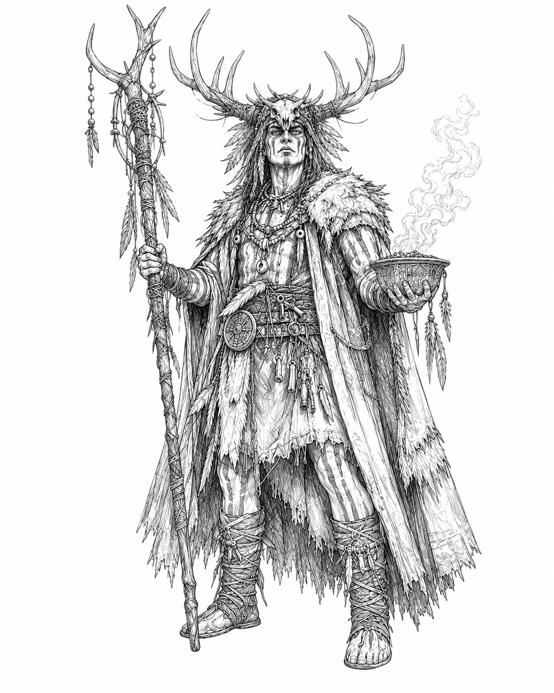

# Gauntlet v0.6 Mystics Faction Guide

> **Definitive v0.6 Mystics faction source.** This guide governs all Mystics-specific rules, Leaders, Rites, Ritual, Invocation, Transmutation, bound cards, supplemental components, and the canonical twelve-card Mystics pool. General movement, battle, capture, Asset, Overlay, and victory rules remain in the core rulebook.

## 1. Mystics overview

The Mystics sacrifice, bind, exchange, and recover cards while completing three public Rites. They may win by running the Gauntlet or by completing Ritual.

### At a glance

| **ELEMENT** | **MYSTICS RULE** |
|---|---|
| **Victory** | Run the Gauntlet or complete Ritual. |
| **Resource** | None. |
| **Trait** | All twelve Mystics cards have the Arcane trait. |
| **Progression** | First completed Rite unlocks Invocation; second unlocks Transmutation; third wins by Ritual. |
| **Leaders** | Alchemist and Spirit Walker. |
| **Faction pool** | 12 Mystics card titles. |
| **Unique card** | Necromancy, cost 5; maximum one copy per Playable Deck. |

### Components

A Mystics Deck includes:

- one Mystics Leader Card: **Alchemist** or **Spirit Walker**;
- one **Mystics Reference Card**;
- three double-sided Rite cards: **Rite of Echoes**, **Rite of Blood**, and **Rite of Crossing**; and
- any Mystics cards included in the Playable Deck.

### Setup

1. Place the chosen Leader Card and Mystics Reference Card near your play area.
2. Place all three Rite cards incomplete side up.

A completed Rite is flipped to its completed side and cannot be begun again. Mystics use no resource tracker.

## 2. Ritual, Rites, Invocation, and Transmutation

### Beginning a Rite

During the Action Opportunity after movement, instead of playing a card for its Action effect, you may begin one incomplete Rite by paying its beginning cost.

- You may have only one begun but incomplete Rite at a time.
- You may begin any uncompleted Rite; there is no required order.
- A Rite cannot complete during the turn it begins.
- Only one Rite may be completed per turn.
- If a Rite is interrupted, it resets and paid costs are not returned unless that Rite says otherwise.

### Ritual progression

- Complete your first Rite to unlock **Invocation**.
- Complete your second Rite to unlock **Transmutation**.
- Complete your third Rite to immediately win by **Ritual**.

### Bound cards

A card bound to a Rite or another card is outside every normal card zone.

- A face-up bound card is public information.
- A face-down bound card may be viewed by its owner but not by the opponent.
- A bound card cannot be played, moved, or affected except as instructed by the effect to which it is bound.
- If the effect ends while a card remains bound and gives no destination, put the bound card in its owner's Graveyard.

### Invocation

Once per turn, when you use an Arcane card for its Action effect or Battle effect, you may move one card from your Graveyard to your Discard Pile.

Invocation may trigger from an Arcane card used from hand, a Battle Hand, the Graveyard, beneath another card, or another source. It does not trigger when an effect merely resolves or repeats another card's Battle effect without using that card again.

### Transmutation

Once per turn, before dice are rolled in a battle involving you, you may put one card from your hand in your Graveyard. Add its deckbuilding value to your battle total.

This is not a hand commitment and does not resolve any printed effect on the card. Supplemental cards cannot be used.

## 3. The three Rites

### Rite of Echoes

**Beginning cost:** Bind one chosen card from your Graveyard face up beneath this Rite. Then bind one card from your hand face down beneath this Rite whose title matches at least one other card in your Playable Deck.

**Completion:** On a later turn, complete this Rite when you use another card with the bound hand card's title for its Battle effect.

On completion:

- move the selected Graveyard card to your Discard Pile;
- put the bound hand card in your Graveyard;
- resolve the completing card normally and follow its normal destination; and
- flip Rite of Echoes to its completed side.

If you lose a battle before completing this Rite, put both bound cards in your Graveyard and reset the Rite.

### Rite of Blood

**Beginning cost:** Put one card from your hand in your Graveyard.

**Completion:** On a later turn, complete this Rite when you win a battle without committing a card from hand and without using a card from your Battle Hand.

Using Transmutation, an Asset, an Overlay, a Territory effect, a Leader ability, or a card from another source does not by itself prevent completion.

If you lose a battle before completing this Rite, reset the Rite. When completed, flip Rite of Blood to its completed side.

### Rite of Crossing

You may begin this Rite only during the Action Opportunity after movement after winning a battle that caused you to occupy a Territory the opponent controlled immediately before that battle.

**Beginning cost:** Put one Arcane card from your hand in your Graveyard. If you have no Arcane card in hand, reveal your hand and move one Arcane card from your Discard Pile to your Graveyard instead.

**Completion:** At the start of your next turn, after the Capture step, complete this Rite if you still occupy or control that Territory. Otherwise, the Rite is interrupted and resets.

When completed, flip Rite of Crossing to its completed side.

## 4. Mystics Leaders

### Alchemist

**Archetype:** Sacrifice sequencing and card conversion  
**Motto:** *Nothing is fixed. Everything can be transformed.*

The Alchemist replaces the first card deliberately sacrificed from hand through a Mystic or Arcane effect during their turn.

#### Materia Prima

The first time on your turn that you put a card from your hand in your Graveyard as part of a Rite, Transmutation, or an Arcane card effect, draw one card.

If this occurs during a battle, draw after the battle resolves.

An ordinary hand commitment does not trigger Materia Prima merely because it later enters the Graveyard during cleanup.

### Spirit Walker

**Archetype:** Ritual endurance and protective sacrifice  
**Motto:** *The spirits remember what the living abandon.*

The Spirit Walker may sacrifice an Arcane card to prevent the first battle-loss interruption of a Rite during their turn.

#### Guardians of the Circle

The first time on your turn that you lose a battle and a begun Rite would be interrupted, you may put one Arcane card from your hand in your Graveyard. If you do, that Rite is not interrupted.

Guardians of the Circle cannot satisfy or preserve a continuing position requirement. In particular, it cannot preserve Rite of Crossing if you no longer occupy or control its required Territory.

## 5. Mystics-specific rules

### Arcane trait

Arcane is a trait, not a faction allegiance. Mystics cards are Arcane, and cards from other pools may also have the trait.

### Entering the Graveyard

A card enters the Graveyard before an effect such as Grave Ward moves it elsewhere. An effect triggered by that entry still resolves even if the card is immediately moved to another zone.

### Exchange

To exchange two cards, move each simultaneously to the other card's previous zone. Both cards must remain eligible and present when the exchange resolves. If either cannot move, the exchange does not occur.

### Additional cards in battle

A card used from the Graveyard through Rend the Veil is neither a hand commitment nor a card from a Battle Hand. It resolves its Battle effect and follows Rend the Veil's destination instruction.

A card committed through Black Covenant is an additional hand commitment. It counts as committed from hand and normally goes to the Graveyard during cleanup.

### Resolving or repeating Battle effects

An effect that resolves or repeats another Battle effect cannot choose an effect that would use another card in the battle or resolve or repeat another Battle effect unless it explicitly permits one additional layer. An additional layer cannot create another layer.

When a Battle effect resolves an additional time:

- make all choices again;
- pay all costs again;
- apply source-dependent instructions only when they can legally function; and
- apply instructions that change the source card's destination or status only once.

An impossible instruction does not prevent the remainder of an otherwise legal effect unless that instruction is a required cost or target.

### Eligible Battle effect

For Witchcraft, an eligible Battle effect:

- belongs to another active card you used in the battle;
- can legally resolve in the current battle;
- does not use another card in the battle; and
- does not resolve or repeat another Battle effect.

Witchcraft cannot repeat Arcane Knowledge, Black Covenant, Rend the Veil, Heresy, Treason, another Witchcraft, or another effect whose function is to add a card or Battle effect.

### Overlays

Unless an Overlay states otherwise:

- its owner makes all choices for its effect;
- it faces the same direction as the Territory beneath it;
- rotate it with that Territory when control changes; and
- changing Territory control does not change Overlay ownership.

A removal condition printed on an Overlay remains active while that Overlay is covered by another Overlay. Spirit Hollow and Circle of Bones therefore leave play when their Territory is captured even while covered.

### After battle cleanup

An effect that occurs after battle cleanup resolves after normal card destinations and other cleanup instructions. Cards placed in the Graveyard during cleanup are eligible for Spirit Hollow.

### Bottom of the Draw Pile

When Necromancy is placed beneath a Draw Pile, place it face down as the bottom card. It is not in a hand, Discard Pile, or Graveyard while there.

## 7. Canonical Mystics card pool

### Dark Omens

**Cost:** 1  
**Trait:** Arcane

> **Action:** Draw two cards, then put one of them in your Graveyard.
>
> **Battle:** Draw one card. You may put it in your Graveyard. If you do, gain advantage.

### Accursed Wager

**Cost:** 2  
**Trait:** Arcane

> **Action:** After the next battle you initiate this turn, the losing player puts one card from their hand in their Graveyard, if able.
>
> **Battle:** After this battle, the losing player puts one card from their hand in their Graveyard, if able.

### Fate's Toll

**Cost:** 2  
**Trait:** Arcane

> **Action:** Put one other card from your hand in your Graveyard. Gain one additional position of movement this turn. Resolve movement one position at a time.
>
> **Battle:** After you roll, you may put one other card from your hand in your Graveyard to reroll. You must use the new result.

### Grave Ward

**Cost:** 2  
**Trait:** Arcane  
**Card form:** Asset

> **Action:** Bank this as an Asset. When a card enters your Graveyard, you may discard this. If you do, move that card from your Graveyard to your Discard Pile.
>
> **Battle:** During battle cleanup, choose one other card you committed from hand during this battle. Move it from your Graveyard to your Discard Pile.

### Spirit Hollow

**Cost:** 3  
**Trait:** Arcane  
**Card form:** Territory Overlay

> **Action:** Place this as an Overlay on your current Territory or an adjacent Territory.
>
> **Battle:** Place this as an Overlay on the contested Territory instead of following its normal destination.
>
> **Overlay:** After battle cleanup following a battle here, each player may put one card from their hand in their Graveyard. A player who does may move one other card from their Graveyard to their Discard Pile.
>
> When this Territory is captured, put this in its owner's Graveyard.

### Soul for Soul

**Cost:** 3  
**Trait:** Arcane

> **Action:** Choose one card in your hand and one card in your Graveyard. Exchange them.
>
> **Battle:** During battle cleanup, after cards committed from your hand enter your Graveyard, you may exchange one card in your hand with one other card in your Graveyard that you committed from hand during this battle.

### Rend the Veil

**Cost:** 3  
**Trait:** Arcane  
**Card form:** Asset

> **Action:** Bank this as an Asset. After all cards in a battle involving you are revealed, you may discard this. If you do, choose one card in your Graveyard whose Battle effect can resolve in this battle and does not use another card or resolve or repeat another Battle effect. Reveal the chosen card face up and resolve its Battle effect.
>
> **Battle:** When revealed, you may choose one card in your Graveyard whose Battle effect can resolve in this battle and does not use another card or resolve or repeat another Battle effect. Reveal the chosen card face up and resolve its Battle effect.
>
> **Reminder:** A card used this way is neither a hand commitment nor a card from a Battle Hand. During battle cleanup, move it to your Discard Pile instead of any other destination.

### Paths of Shadow

**Cost:** 3  
**Trait:** Arcane

> **Action:** Move to any Territory you control. This movement cannot initiate a battle.
>
> **Battle:** If you lose this battle, you may move to any Territory you control instead of retreating normally.

### Witchcraft

**Cost:** 4  
**Trait:** Arcane  
**Card form:** Asset

> **Action:** Bank this as an Asset. Once per turn, after all cards in a battle involving you are revealed, you may put one card from your hand in your Graveyard. If you do, choose one other active card you used in the battle with an eligible Battle effect. Resolve that effect one additional time.
>
> **Battle:** When revealed, choose one other active card you used in the battle with an eligible Battle effect. Resolve that effect one additional time. If you cannot choose one, gain advantage. During battle cleanup, put this in your Graveyard.
>
> **Reminder:** Make all choices and pay all costs again when the effect repeats.

### Black Covenant

**Cost:** 4  
**Trait:** Arcane  
**Card form:** Asset with bound card

> **Action:** Bind one other card from your hand face down beneath this, then bank this as an Asset. While banked, you may either play the bound card for its Action effect at a legal Action timing without using your normal Action Opportunity, or commit it during a battle as an additional hand commitment. The bound card follows the normal destination for a card used from hand. After the bound card resolves, put this in your Graveyard.
>
> **Battle:** When revealed, you may bind one other card from your hand that has a Battle effect beneath this, then immediately commit and reveal it as an additional hand commitment. During battle cleanup, put this in your Graveyard.
>
> **Reminder:** If this leaves play while a card remains bound beneath it, put the bound card in your Graveyard.

### Circle of Bones

**Cost:** 4  
**Trait:** Arcane  
**Card form:** Territory Overlay

> **Action:** Place this as an Overlay on your current Territory or an adjacent Territory.
>
> **Battle:** Place this as an Overlay on the contested Territory instead of following its normal destination.
>
> **Overlay:** Once during each battle here involving you, after dice are rolled, you may put one card from your hand in your Graveyard. If you do, choose either player. That player rerolls and must use the new result.
>
> When this Territory is captured, put this in its owner's Graveyard.

### Necromancy

**Cost:** 5  
**Trait:** Arcane  
**Unique:** Maximum one copy per Playable Deck

> **Action:** Choose one:
>
> - Place this face down beneath your Draw Pile, then draw one card.
> - Choose up to three non-Necromancy cards in your Graveyard. Put every other card in your hand in your Graveyard, then return the chosen cards to your hand. Put this in your Graveyard.
>
> **Battle:** During battle cleanup, after your other used cards follow their normal destinations, choose up to three non-Necromancy cards in your Graveyard. Put every card remaining in your hand in your Graveyard, then return the chosen cards to your hand. This follows its normal destination.

## 8. Package summary and development watchlist

### Card-pool summary

| **COST** | **MYSTICS CARDS** |
|---:|---|
| **1** | Dark Omens |
| **2** | Accursed Wager, Fate's Toll, Grave Ward |
| **3** | Spirit Hollow, Soul for Soul, Rend the Veil, Paths of Shadow |
| **4** | Witchcraft, Black Covenant, Circle of Bones |
| **5** | Necromancy — Unique |

All twelve cards have the Arcane trait.

## Appendix A. Mystics quick reference

### Ritual progression

1. During the Action Opportunity after movement, pay a beginning cost to begin one incomplete Rite.
2. A Rite cannot complete that turn.
3. First completed Rite: unlock Invocation.
4. Second completed Rite: unlock Transmutation.
5. Third completed Rite: win by Ritual.

### Invocation

Once per turn, when you use an Arcane card for its Action or Battle effect, move one card from your Graveyard to your Discard Pile.

### Transmutation

Once per turn before dice, put one card from hand in your Graveyard and add its deckbuilding value to your battle total.

### Leaders

- **Alchemist — Materia Prima:** The first listed sacrifice from hand during your turn draws one replacement card.
- **Spirit Walker — Guardians of the Circle:** The first battle-loss interruption during your turn may be prevented by sacrificing one Arcane card, unless a continuing position requirement is no longer satisfied.

---

Gauntlet v0.6 © 2026 Tymon Scott. All rights reserved. Mystics Faction Guide.
