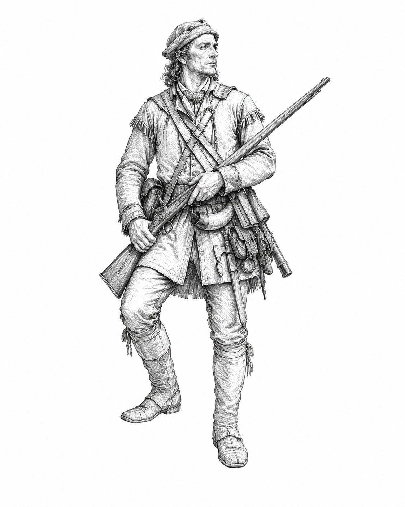

# Gauntlet v0.6 Intelligence Faction Guide

> **Definitive v0.6 Intelligence faction source.** This guide governs all Intelligence-specific rules, leaders, Intel, Missions, Operation Progress, Surveillance, Interference, Special Operation, supplemental components, strategy, terminology, and the canonical twelve-card pool. The adjacent DOCX and PDF are release-formatted editions of this source. General game rules remain in the v0.6 core rules.

Use this guide with the Gauntlet v0.6 core rules. General movement, battle, retreat, occupation, capture, deck construction, Assets, Overlays, card destinations, and ordinary breakthrough victory procedures remain in the core rulebook.

Leader illustrations for release layout use:

- `../../../../images/sketches/ranger.png`
- `../../../../images/sketches/spymaster.png`

The printable Leader Cards use dedicated crops under `../../../../images/leader-cards/`.

---

## Contents

| Section | Contents |
|---|---|
| 1. Intelligence overview | Identity, victory, components, and setup |
| 2. Intel, Missions, and Special Operation | Resource flow, Mission lifecycle, Operation Progress, and faction victory |
| 3. Surveillance and Interference | Battle commitment order, information timing, and disruption |
| 4. Intelligence leaders | Ranger and Spymaster |
| 5. Playing Intelligence | Strategy, strengths, limits, and counterplay |
| 6. Canonical Intelligence card pool | All twelve cards with exact text |
| 7. Card-pool summary | Cost curve, strategic threads, and deckbuilding reference |
| Appendix A. Quick reference | Condensed faction procedures and card list |

# 1. Intelligence overview

The Intelligence faction turns incomplete information into deliberate action. Its cards reveal commitments, protect or revise hidden objectives, disrupt opposing plans, and prepare operations that mature over several turns. Intelligence may still win by running the Gauntlet, but it can also coordinate a decisive **Special Operation** after completing enough normal Missions.

> **Faction identity:** Learn enough to act with confidence, but never so much that gathering information replaces acting on the board.

## At a glance

| Element | Intelligence rule |
|---|---|
| **Victory** | Run the Gauntlet or complete a Special Operation. |
| **Resources** | Intel and Operation Progress. Both begin at 0. |
| **Core system** | Start one face-down Mission; satisfy its printed requirement; complete it later for Intel and Operation Progress. |
| **Battle tools** | Spend Intel on Surveillance and Interference. |
| **Leaders** | Ranger - terrain and hostile-ground operations. Spymaster - Mission tempo and network coordination. |
| **Faction pool** | 12 unique Intelligence cards; curve 1 / 3 / 4 / 3 / 1 at costs 1-5. |
| **Statement card** | Sleeper Network, cost 5 and Unique. |

## Components and setup

An Intelligence deck uses:

1. one selected Leader Card: **Ranger** or **Spymaster**;
2. one **Mission Reference**;
3. one **Operations Reference**;
4. one **Intelligence Resource Tracker** and two small markers, one for Intel and one for Operation Progress;
5. any Intelligence playable cards included through normal deck construction.

Set Intel and Operation Progress to 0. The printed tracker is a convenience, not a resource maximum. If either value exceeds the printed track, use a die, note, or additional marker to record the excess.

Only an Intelligence card with a printed **Mission** requirement may be started as a normal Mission or Special Operation.

---

# 2. Intel, Missions, and Special Operation

## Intel

Intel represents actionable information. It begins at 0, cannot fall below 0, and has no maximum.

Intel may be spent to:

- use Surveillance;
- use Interference after Surveillance;
- use the Ranger's Fieldcraft;
- abort an Active Mission;
- pay the final cost of a Special Operation;
- resolve any card effect that specifically requires Intel.

The faction does not gain Intel automatically. Normal Missions are its primary source.

## Operation Progress

Operation Progress begins at 0. Each completed normal Mission adds 1 Operation Progress, regardless of that Mission's value. Operation Progress is not normally spent. It measures whether the Intelligence network is sufficiently prepared to attempt a Special Operation.

## Starting a Mission

During the Action phase after movement, instead of playing an Action card, place one Intelligence card from your hand with a printed Mission requirement face down near your Leader Card as your **Active Mission**.

- You may look at your Active Mission at any time.
- You may have only one Active Mission.
- You cannot have an Active Mission and a Special Operation simultaneously.
- A Mission cannot complete on the turn it begins.
- Its requirement counts only while it is the Active Mission.

Starting a Mission uses the same Action opportunity that could have been used to play an Action card. It is not itself playing an Action card.

## Completing a Mission

During the Action phase after movement, instead of playing an Action card, reveal and complete your Active Mission if its printed requirement has been satisfied.

When it completes:

1. increase Operation Progress by 1;
2. gain Intel equal to the Mission card's deckbuilding value;
3. discard the Mission card.

A satisfied Mission remains active until you use the Action opportunity to complete it. Satisfying the requirement does not complete it automatically.

## Aborting and failing

During the Action phase after movement, instead of playing an Action card, reveal your Active Mission and spend Intel equal to its deckbuilding value to **abort** it. Discard it.

Aborting is a deliberate withdrawal and is not failure. A Mission **fails** only through opponent disruption, a compromised game state, or an effect that specifically causes failure. Reveal a failed Mission and place it in your Graveyard.

## Special Operation

A Special Operation is Intelligence's faction victory attempt.

You may start one only if:

- your Operation Progress is greater than the number of Territories the opponent controls;
- you have no Active Mission;
- you have an Intelligence card in hand with a printed Mission requirement.

During the Action phase after movement, instead of playing an Action card, place that card face down near your leader as the **Special Operation**.

The Special Operation uses the card's printed Mission requirement, but it is not a normal Mission. It grants no Intel or Operation Progress and does not trigger abilities that require completing a normal Mission.

If your Operation Progress ceases to exceed the number of Territories the opponent controls, the Special Operation fails immediately. Reveal it and place it in your Graveyard.

During the Action phase after movement, if the Special Operation's requirement is satisfied and readiness remains valid, reveal it and pay Intel equal to:

> **Territories in the Gauntlet - Special Operation card value**

The minimum payment is 1 Intel. If you pay, you immediately win by **Special Operation**.

> **Operational tension:** Higher-value Mission cards are harder to complete, but they generate more Intel as normal Missions and reduce the final cost when used as the Special Operation.

---

# 3. Surveillance and Interference

## Battle commitment order

Intelligence effects rely on the normal sequence of hidden commitments.

### Hand commitments

1. The attacker commits one Battle card from hand face down or passes.
2. The defender commits one Battle card from hand face down or passes.

### Battle draw

1. The attacker draws their initial battle draw and selects one card face down, or passes if allowed.
2. The defender draws their initial battle draw and selects one card face down, or passes if allowed.
3. Reveal and resolve Battle cards normally.

A card that changes commitment order or reveals before the normal reveal follows its own text.

## Surveillance

Once per battle, when the opponent commits or plays a face-down Battle card in a battle involving you, spend 1 Intel to look at that card before the battle proceeds.

- A defending Intelligence player may inspect the attacker's hand commitment before deciding their own.
- A defending Intelligence player may inspect the attacker's selected battle-drawn card before choosing their own.
- An attacking Intelligence player may inspect the defender's hand commitment before battle draw.
- An attacking Intelligence player may inspect the defender's selected battle-drawn card before the normal reveal.
- Each Intelligence player may use Surveillance once per battle, including in a mirror match.

Surveillance reveals information only to the player who used it unless an effect says otherwise.

## Interference

After Surveillance lets you look at an opposing face-down Battle card, you may spend 2 additional Intel to remove it from the battle. The opponent may choose another legal card from the same source, if able.

- A hand commitment returns to its owner's hand.
- A battle-drawn card returns to that battle draw and is no longer the selected card.
- If no replacement is chosen, the opponent plays no card from that source.
- Unplayed battle-drawn cards are discarded normally.

Interference disrupts rather than destroys. It does not create another Surveillance or response window.

> **Resource choice:** The same Intel may preserve the Ranger from a hostile Territory, rescue a compromised Mission through abortion, interfere with a Battle card, or fund the final Special Operation. Information is useful only when converted at the right moment.

---

# 4. Intelligence leaders

## Ranger

**Know the land before the battle begins.**  
**Style:** terrain mastery, reconnaissance, hostile-ground operation.

The Ranger reads the land before armies know they are lost. Where others see forest, river, and stone, the Ranger sees routes, risks, and advantage. The Ranger uses Intel to prevent exposed Territory effects from dictating movement or battle, then combines that freedom with reconnaissance and carefully timed withdrawal.

Choose the Ranger when you want to operate aggressively on revealed Territories, preserve Intel for board positioning, and use faction cards as tactical substitutes for Surveillance.

### Fieldcraft

> **Once per turn, when a revealed Territory effect would affect you, your movement, or a battle involving you, spend 1 Intel to ignore that Territory effect until end of turn.**

Fieldcraft does not ignore ownership, occupation, capture, Heartland rules, Homeland Advantage, or Asset-bank limits.

Ranger priorities:

- preserve Intel when a hostile Territory could decide movement or battle;
- use Reconnaissance, Fog of War, and Exfiltration to enter, test, and leave dangerous ground;
- obtain information through cards when saving Intel for Fieldcraft matters more than using Surveillance;
- complete Missions that arise naturally from occupation and counterattack rather than forcing a fragile sequence.

## Spymaster

**Information never rests. Momentum is the weapon.**  
**Style:** Mission tempo, network command, covert coordination.

The Spymaster is the architect of covert operations. Each completed Mission immediately becomes the opening of another, allowing a successful network to sustain pressure without spending another Action opportunity merely to restore its hidden objective.

Choose the Spymaster when you want to sequence Missions, protect or revise an operation already in motion, and convert successful objectives into continuous preparation for a Special Operation.

### Mission Control

> **Once per turn, after completing a normal Mission, immediately start a new Mission from hand without using the Action opportunity.**

The new Mission cannot complete that turn. Mission Control cannot start a Special Operation.

Spymaster priorities:

- keep at least one playable Mission card in hand before completing the current Mission;
- use Operational Reassessment when the board no longer supports the hidden objective;
- use Deep Cover to make opponent-driven failure costly without making Missions invulnerable;
- avoid pursuing Operation Progress so mechanically that ordinary territorial pressure is neglected.

---

# 5. Playing Intelligence

## The central decision

> **HOW MUCH DO YOU NEED TO KNOW?** Gather enough information to choose a strong line, then act before the cost of preparation exceeds the value of certainty.

Intelligence's central tension is **immediate action versus prepared certainty**. A card used as an Action, Battle effect, Mission, stored Sleeper Network operation, or hand commitment cannot serve all of those roles at once.

## What Intelligence does well

- **Information and adaptation:** Spies, Reconnaissance, Intercepted Orders, and Surveillance reveal commitments before the plan is locked.
- **Mission planning:** Six different Mission requirements support accessible, positional, and difficult operations.
- **Commitment manipulation:** Fog of War and Disinformation make the opponent reconsider when and whether to commit from hand or battle draw.
- **Tactical disruption:** Assassins, Subversion, Treason, Interference, and Intercepted Orders attack specific preparations rather than applying blanket suppression.
- **Visible long-term preparation:** Sleeper Network creates a public threat with hidden contents and meaningful counterplay.
- **Leader flexibility:** The Ranger converts Intel into terrain freedom; the Spymaster converts completed Missions into tempo.

## What Intelligence does not do

Intelligence has:

- no forward-movement acceleration;
- no capture shortcut;
- no unconditional draw engine;
- little direct numerical battle strength;
- limited permanent Asset removal;
- no guarantee that a Mission requirement will remain achievable;
- substantial Action pressure from starting, completing, aborting, or replacing Missions;
- an alternate victory that becomes vulnerable if the opponent regains Territory control.

## Strategic threads

| Thread | Cards |
|---|---|
| Reconnaissance and adaptation | Spies; Intercepted Orders; Reconnaissance; Operational Reassessment; Treason |
| Mission planning and operational commitment | Spies; Fog of War; Disinformation; Reconnaissance; Assassins; Subversion; Deep Cover |
| Misdirection and concealed commitment | Fog of War; Disinformation; Deep Cover |
| Sabotage and counteroperations | Intercepted Orders; Assassins; Subversion; Treason |
| Infiltration and extraction | Reconnaissance; Exfiltration |
| Long-term preparation | Fog of War; Deep Cover; Sleeper Network |

The pool is a strategic vocabulary, not a required package. An Intelligence deck may emphasize field operations, Mission tempo, battle disruption, hidden preparation, or a hybrid plan. The printed faction rules remain functional without any particular card.

## Playing against Intelligence

- pressure the board while Intelligence spends Action opportunities starting or completing Missions;
- vary hand commitments so Disinformation and Assassins do not receive automatic value;
- remember that Surveillance is once per battle and Interference costs 3 Intel total;
- take Territories to reduce Special Operation readiness and Sleeper Network capacity;
- use Counterintelligence, Decoys, Sabotage, Sequestration, and other shared counterplay to contest information and Assets;
- force the Ranger to spend Intel on terrain before a decisive battle, or force the Spymaster to complete a Mission without another one ready;
- treat a visible Sleeper Network as a timing problem: remove it early and accept one emergency effect, or race the larger operation.

---

# 6. Canonical Intelligence card pool

## Exfiltration

**Cost:** 1  
**Complexity:** Basic

> **Action:** Bank Exfiltration as an Asset. After you complete or abort a Mission, you may discard Exfiltration. If you do, withdraw.
>
> **Battle:** If you lose, you may retreat one additional space.

## Spies

**Cost:** 2  
**Complexity:** Advanced

> **Action:** Look at your opponent's hand. Draw one card, then discard one card.
>
> **Battle:** Reveal Spies before the other Battle cards. Look at each face-down Battle card your opponent played. You may return your selected battle-drawn card to your battle draw and choose another card from that draw face down.
>
> **Mission:** Complete after you look at or reveal an opposing face-down Battle card before the normal reveal, then win that battle.

## Fog of War

**Cost:** 2  
**Complexity:** Advanced  
**Card form:** Territory Overlay

> **Action:** Place Fog of War as an Overlay on a revealed Territory. Remove it after the next battle there. During that battle, make each hand commitment and battle-draw selection after your opponent makes the corresponding choice, regardless of who initiated the battle.
>
> **Battle:** Reveal Fog of War before the other Battle cards. If your opponent played a card from both hand and battle draw, they choose one of those cards and return it to its source. They play no card from that source.
>
> **Mission:** Complete after your opponent plays a Battle card from both hand and battle draw in a battle involving you, then loses that battle.

## Disinformation

**Cost:** 2  
**Complexity:** Advanced

> **Battle:** If you committed Disinformation from hand, reveal it before the other Battle cards. If your opponent also committed from hand, gain advantage. Return Disinformation to your hand during cleanup.
>
> **Mission:** Complete after you win a battle in which your opponent committed a Battle card from hand and you did not.

## Operational Reassessment

**Cost:** 3  
**Complexity:** Advanced

> **Action:** Return your Active Mission to your hand, then place another Intelligence card from your hand with a Mission requirement face down as your Active Mission. It cannot be completed this turn.
>
> **Battle:** After all Battle cards are revealed, you may replace Operational Reassessment with a Battle card from your hand whose Battle effect can still resolve. If you do, put Operational Reassessment in your Graveyard and play that card face up.

## Intercepted Orders

**Cost:** 3  
**Complexity:** Advanced

> **Action:** Bank Intercepted Orders as an Asset. When your opponent draws their initial battle draw in a battle involving you, before they choose a card, you may discard Intercepted Orders. If you do, look at that draw and choose one card. They cannot play that card during this battle.
>
> **Battle:** Reveal Intercepted Orders before the other Battle cards. Look at your opponent's battle draw and choose one card. They cannot play that card during this battle. If it was their selected card, they may choose another legal card from that draw face down.

## Reconnaissance

**Cost:** 3  
**Complexity:** Advanced

> **Action:** Bank Reconnaissance as an Asset. When a battle you initiated begins, you may discard Reconnaissance to look at your opponent's hand. You may then withdraw before Battle cards are committed.
>
> **Battle:** Reveal Reconnaissance before the other Battle cards. After the remaining Battle cards are revealed, before any of their effects resolve, you may withdraw. If you do, return all other Battle cards to their sources.
>
> **Mission:** Complete after you win a battle you did not initiate while occupying an enemy-controlled Territory.

## Deep Cover

**Cost:** 3  
**Complexity:** Advanced

> **Action:** Bank Deep Cover as an Asset. When your Active Mission would fail, you may put Deep Cover in your Graveyard. If you do, return that Mission to your hand instead.
>
> **Battle:** If an opposing effect looked at or revealed one of your face-down Battle cards before the normal reveal, gain advantage.

## Assassins

**Cost:** 4  
**Complexity:** Advanced

> **Action:** Look at your opponent's hand. Choose one card from it and discard that card.
>
> **Battle:** Reveal Assassins before the other Battle cards. If your opponent committed from hand, reveal and negate that card. Otherwise, give your opponent disadvantage during this battle.
>
> **Mission:** Complete after you look at one or more cards in your opponent's hand outside a battle, then win a battle against that opponent in which they committed from hand.

## Treason

**Cost:** 4  
**Complexity:** Advanced

> **Action:** Bank Treason as an Asset. After all Battle cards are revealed in a battle involving you, before their effects resolve, you may discard Treason. If you do, choose one opposing Battle card. Negate it, then resolve its Battle effect as though you played it.
>
> **Battle:** Reveal Treason before the other Battle cards. After the remaining Battle cards are revealed, before their effects resolve, choose one opposing Battle card. Negate it, then resolve its Battle effect as though you played it.

## Subversion

**Cost:** 4  
**Complexity:** Advanced

> **Action:** Bank Subversion as an Asset. When an opposing banked Asset's effect would resolve, you may put Subversion in your Graveyard. If you do, negate that effect and discard that Asset if it remains in play.
>
> **Battle:** Opposing banked Assets cannot be used during this battle.
>
> **Mission:** Complete after you win a battle in which your opponent used a banked Asset and you used none.

## Sleeper Network

**Cost:** 5  
**Complexity:** Advanced  
**Unique:** Maximum one copy per deck

> **Action:** Bank Sleeper Network as an Asset with one other card from your hand face down beneath it. At the end of each of your later turns, you may place one other card from your hand face down beneath it.
>
> Sleeper Network can hold no more cards than the number of Territories you control. If it holds too many, immediately discard cards beneath it of your choice until it does not.
>
> At the start of your turn, you may put Sleeper Network in your Graveyard. If you do, reveal the cards beneath it. Play each of those cards whose Action effect can legally resolve, one at a time and in any order, without using Action opportunities. Discard the rest.
>
> When an opposing effect would cause Sleeper Network to leave play, before it does, reveal the cards beneath it. You may play one of those cards whose Action effect can legally resolve without using an Action opportunity. Discard the rest.
>
> If Sleeper Network leaves play for any other reason, discard all cards beneath it.

---

# 7. Card-pool summary

## Pool profile

| Cost | Cards |
|---:|---|
| 1 | Exfiltration |
| 2 | Spies; Fog of War; Disinformation |
| 3 | Operational Reassessment; Intercepted Orders; Reconnaissance; Deep Cover |
| 4 | Assassins; Treason; Subversion |
| 5 | Sleeper Network |
| **Total** | **12 unique cards; total unique-card value 36; average cost 3.00** |

## Mission profile

| Card | Cost | Requirement pattern |
|---|---:|---|
| Disinformation | 2 | Win after the opponent commits from hand and you do not |
| Fog of War | 2 | Defeat an opponent who committed from both sources |
| Spies | 2 | Obtain early Battle information, then win |
| Reconnaissance | 3 | Survive and win an occupation counterattack |
| Assassins | 4 | Conduct advance hand reconnaissance, then exploit a hand commitment |
| Subversion | 4 | Defeat an Asset-supported operation without using an Asset |

The six Missions provide accessible, intermediate, and difficult objectives without requiring a particular leader or a single mandatory partner card. No cost-1 Mission cheaply farms Operation Progress. The two cost-4 Missions offer demanding routes to larger Intel rewards and cheaper Special Operation payments.

## Selecting cards

- For a Ranger field-operations deck, consider Reconnaissance, Fog of War, Exfiltration, Intercepted Orders, and Assassins, then add Neutral movement and recovery without erasing the faction's lack of capture shortcuts.
- For a Spymaster Mission deck, consider several differently conditioned Missions, Operational Reassessment, Deep Cover, and Sleeper Network, while retaining enough ordinary battle and movement tools to contest the Gauntlet.
- Disinformation, Spies, and Treason reward reading commitment patterns rather than simply accumulating information.
- Subversion is strongest in Asset-heavy matchups; it should compete with broader disruption rather than become a universal inclusion.

## Unique and copies

Sleeper Network is Unique: maximum one copy per deck. The other Intelligence cards use the normal v0.6 copy rules. Costs count toward the deckbuilding-value limit but do not determine draw rate.

## Complexity and watchlist

Exfiltration is Basic. The other eleven cards are Advanced because they involve hidden information, special reveal timing, Mission state, replacement, copied effects, stored cards, or reactive Asset timing.

Initial playtest priorities:

- whether Spies becomes an automatic inclusion or makes Surveillance and Scouting Report redundant;
- whether Fog of War is underpriced as a persistent cost-2 Overlay;
- whether Disinformation sustains meaningful bluffing after it has been revealed once;
- whether Deep Cover's Mission protection is appropriately costly and its Battle mode appears often enough;
- whether Sleeper Network's removal choice, capacity scaling, and multi-Action activation remain dramatic but answerable;
- whether Ranger and Spymaster remain comparably strong across conventional and Special Operation plans;
- whether Special Operation readiness and final Intel cost create visible pressure without ending games abruptly.

## Release authority

This Markdown file is the definitive Intelligence source. The adjacent DOCX and PDF are release-formatted editions of it. If a historical draft, approval note, development conversation, earlier card sheet, or other repository file differs, use this guide until a later official v0.6 revision replaces it.

---

# Appendix A. Quick reference

## Setup

- Choose Ranger or Spymaster.
- Set Intel and Operation Progress to 0.
- Keep the Mission Reference and Operations Reference available.

## Normal Mission

1. After movement, instead of playing an Action card, place a Mission card face down.
2. It cannot complete that turn; its requirement counts only while active.
3. Later, after movement, reveal and complete it instead of playing an Action card.
4. Gain 1 Operation Progress and Intel equal to its value; discard it.
5. To abort, spend Intel equal to its value and discard it. A failed Mission goes to the Graveyard.

## Special Operation

1. Operation Progress must exceed opposing controlled Territories.
2. Have no Active Mission.
3. Start a Mission card face down as the Special Operation.
4. If readiness is lost, it fails.
5. Satisfy its requirement and pay `Territories in the Gauntlet - card value`, minimum 1 Intel, to win.

## Surveillance and Interference

- Once per battle, spend 1 Intel to look at one opposing face-down Battle card when it is committed or selected.
- After Surveillance, spend 2 more Intel to remove that card from the battle. The opponent may replace it from the same source.

## Leaders

- **Ranger - Fieldcraft:** Once per turn, spend 1 Intel to ignore a revealed Territory effect affecting you, your movement, or your battle until end of turn.
- **Spymaster - Mission Control:** Once per turn after completing a normal Mission, immediately start another Mission from hand. It cannot complete that turn and cannot be the Special Operation.

## Cards by cost

- **1:** Exfiltration
- **2:** Spies; Fog of War; Disinformation
- **3:** Operational Reassessment; Intercepted Orders; Reconnaissance; Deep Cover
- **4:** Assassins; Treason; Subversion
- **5:** Sleeper Network
